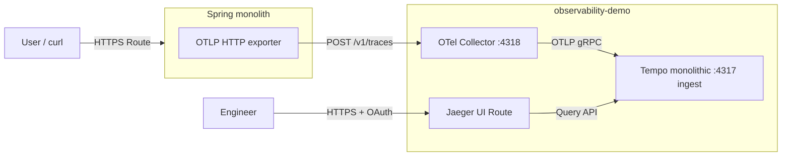

# OpenShift 4.18 Observability Demo — Tempo, OpenTelemetry Collector, Spring Monolith & Jaeger UI

Practical guide to deploy and **test distributed tracing** on **OpenShift Container Platform 4.18** using **Red Hat OpenShift distributed tracing (Tempo Operator)**, **Red Hat build of OpenTelemetry Operator**, an in-cluster **OpenTelemetry Collector**, and the **Spring Boot monolith** from **[github.com/sawoohoorun/ocp-observ-monolithic](https://github.com/sawoohoorun/ocp-observ-monolithic)**. Images are built **inside the cluster** (`BuildConfig` + Git). **No Helm, no Argo CD, no PVCs** — **ephemeral** storage only (`TempoMonolithic` memory backend, `emptyDir` where needed).

Manifests live under `observability-demo-ocp418/` in the repository; this document describes **what they do** and **which commands to run**, without inlining every YAML file.

---

## Architecture Summary

| Piece | Role |
|-------|------|
| **Tempo Operator** (`openshift-tempo-operator`) | Installs/manages Tempo custom resources. |
| **OpenTelemetry Operator** (`openshift-opentelemetry-operator`) | Deploys `OpenTelemetryCollector` from CRs. |
| **`TempoMonolithic`** (`observability-demo`) | Single-pod Tempo with **in-memory** trace storage (tmpfs, no PVC). Ingests OTLP (gRPC) from the Collector. |
| **Jaeger UI** | Provided by the Tempo operator for `TempoMonolithic` when `spec.jaegerui` is enabled: the UI is a **query frontend** that talks to **Tempo’s query API** — traces are **stored in Tempo**, not in a separate Jaeger storage backend. |
| **`OpenTelemetryCollector`** | Receives **OTLP/HTTP** from the app on `:4318`, exports **OTLP/gRPC** to Tempo’s distributor on `tempo-demo:4317`. |
| **Spring monolith** | Emits traces via Micrometer + OTLP to the Collector; layered HTTP + manual spans (≥3 per request flow). |
| **`BuildConfig` (Docker + Git)** | Clones this repo, builds with multi-stage `Dockerfile` + Maven Wrapper, pushes `ImageStreamTag` `demo-monolith:1.0.0`. |



---

## OCP 4.18 Assumptions

- Connected cluster (or equivalent) with **`redhat-operators`** in `openshift-marketplace`.
- **`cluster-admin`** (or equivalent) for operator install and project creation.
- Build pods can reach **GitHub** (clone) and **Maven Central** (Maven Wrapper).
- Pull access to **Red Hat registries** used in the `Dockerfile` (`registry.access.redhat.com/ubi9/openjdk-21`).
- **OperatorHub** available in the web console for Path B.

---

## Existing Source Code Assessment

The demo application **is** this repository. The service is **`observability-demo-ocp418/spring-monolith/`**:

- **Maven**, **Spring Boot 3.4.x**, **Java 21**.
- **Entry API:** `GET /ui/orders/{id}` (`OrderController`).
- **Business:** `OrderService.getOrder` with a **manual** OpenTelemetry span.
- **Integration:** `InventoryClient` / `PricingClient` use **`RestClient`** against loopback internal APIs (`InternalApiController`) so **client + server** HTTP spans appear in the **same trace** with W3C propagation.

This satisfies a **monolith** with **at least three spans** (ingress + business + integration HTTP) in one trace.

---

## Repository Structure Summary

- **`observability-demo-ocp418/*.yaml`** — Namespaced/cluster-scoped install and workload manifests.
- **`observability-demo-ocp418/spring-monolith/`** — Application source (`pom.xml`, `Dockerfile`, `mvnw`, `src/...`).
- **`observability-demo-ocp418/30-smoketest.md`** — Optional short checklist (build + HTTP + UI hints).
- **`OCP-4.18-Observability-Demo-Deployment.md`** / **`README.md`** — This guide (kept aligned).

---

## What Changed in the Application Code

| File / area | Change | Why |
|-------------|--------|-----|
| `spring-monolith/Dockerfile` | Multi-stage build; `microdnf install -y gzip tar` before `./mvnw` | OpenShift **Git + Docker** build has no `target/`; wrapper needs **gzip** to unpack Maven dist on slim UBI. |
| `mvnw`, `.mvn/wrapper/` | Added Maven Wrapper | Reproducible **`./mvnw package`** inside the build container without yum-installed Maven. |
| `spring-monolith/.s2i/environment` | `MAVEN_ARGS_APPEND=-DskipTests` | Optional **Source-to-Image** `BuildConfig` path only. |
| Java / `pom.xml` / tracing | Baseline retained | Micrometer OTel bridge + OTLP exporter + manual `OrderService` span + `RestClient` instrumentation. |

No replacement sample app — same codebase as the repo.

---

## File Tree

```text
observability-demo-ocp418/
├── 00-namespace.yaml
├── 01-operatorgroup.yaml
├── 02-subscriptions.yaml
├── 10-tempo.yaml
├── 11-otel-collector.yaml
├── 20-app-imagestream.yaml
├── 21-app-buildconfig.yaml
├── 22-app-configmap.yaml
├── 23-app-deployment.yaml
├── 24-app-service.yaml
├── 25-app-route.yaml
├── 30-smoketest.md
└── spring-monolith/
    ├── Dockerfile
    ├── pom.xml
    ├── mvnw
    ├── .mvn/wrapper/
    ├── .s2i/environment
    └── src/main/...
```

---

## File Purpose Summary

| File | Purpose |
|------|---------|
| `00-namespace.yaml` | Creates `openshift-tempo-operator`, `openshift-opentelemetry-operator`, `observability-demo` (restricted PSA labels on demo NS). |
| `01-operatorgroup.yaml` | Empty-spec `OperatorGroup` in each operator namespace (all-namespaces install pattern). |
| `02-subscriptions.yaml` | OLM `Subscription` for `tempo-product` and `opentelemetry-product` (channel `stable`, `redhat-operators`). |
| `10-tempo.yaml` | `TempoMonolithic` named `demo`: memory storage, **Jaeger UI + Route** enabled. |
| `11-otel-collector.yaml` | `OpenTelemetryCollector` `otel`: OTLP in, export to `tempo-demo` gRPC, optional `debug` exporter. |
| `20-app-imagestream.yaml` | `ImageStream` `demo-monolith` for build output. |
| `21-app-buildconfig.yaml` | Git → `contextDir` `observability-demo-ocp418/spring-monolith`, **Docker** strategy, tag `demo-monolith:1.0.0`. |
| `22-app-configmap.yaml` | Optional documentation ConfigMap (not mounted by default). |
| `23-app-deployment.yaml` | `Deployment` for app: OTLP env, probes, `emptyDir` `/tmp`, image pull from internal registry + **ImageStream trigger** for `1.0.0`. |
| `24-app-service.yaml` | `ClusterIP` Service port 8080. |
| `25-app-route.yaml` | Edge TLS **Route** to the app. |
| `30-smoketest.md` | Copy-paste checks for build, curl, collector logs, Tempo pod. |

**Edit before apply if needed:** `21-app-buildconfig.yaml` — change `spec.source.git.uri` / `ref` for a fork or non-`main` branch.

---

## Prerequisites

- `oc` CLI, logged in with rights to install operators and manage `observability-demo`.
- Disk/memory for one Tempo monolith pod, one collector pod, one app pod, plus build pods.

---

## Deployment Option Matrix

| Activity | Path A — CLI-first | Path B — Web console hybrid |
|----------|--------------------|-----------------------------|
| Namespaces | `oc apply -f observability-demo-ocp418/00-namespace.yaml` | Same, or create `observability-demo` in UI |
| Tempo operator | `01` + `02` (tempo subscription) | **OperatorHub** → Tempo Operator → `openshift-tempo-operator` |
| OpenTelemetry operator | `02` (opentelemetry subscription) | **OperatorHub** → Red Hat build of OpenTelemetry |
| Operands (Tempo, Collector, app) | `oc apply` manifest files | Same after operators are **Succeeded** |

---

## Operator Installation Steps

**Path A (CLI)**

```bash
oc apply -f observability-demo-ocp418/00-namespace.yaml
oc apply -f observability-demo-ocp418/01-operatorgroup.yaml
oc apply -f observability-demo-ocp418/02-subscriptions.yaml
```

Wait until CSVs succeed:

```bash
oc get csv -n openshift-tempo-operator
oc get csv -n openshift-opentelemetry-operator
```

Expect **`tempo-product`** and **`opentelemetry-product`** in phase **Succeeded**.

**Path B** — see **Web Console Install Path** at the end of this document.

---

## Observability Stack Deployment Steps

```bash
oc apply -f observability-demo-ocp418/10-tempo.yaml
oc apply -f observability-demo-ocp418/11-otel-collector.yaml
```

Confirm:

```bash
oc get tempomonolithic -n observability-demo
oc describe tempomonolithic demo -n observability-demo
oc get opentelemetrycollector,pods -n observability-demo
```

**Jaeger UI:** `10-tempo.yaml` sets `spec.jaegerui.enabled: true` and `spec.jaegerui.route.enabled: true`. The operator creates a **Route** (name pattern like `tempo-demo-jaegerui` — confirm with `oc get routes -n observability-demo`). The UI uses **OAuth** via OpenShift; it **queries Tempo** for traces (Tempo holds the data).

---

## Application Build Steps Using OpenShift Build / S2I

**Why Docker `BuildConfig` (not classic S2I only)**  
The app targets **Java 21** and builds with **Maven Wrapper** in a **multi-stage Dockerfile**. Many clusters only expose **`openshift/java`** S2I for older JDKs. **Docker strategy + Git** still runs **entirely inside OpenShift** and matches this repo. Optional **S2I** is documented in-repo via `.s2i/environment` and the guide’s **Troubleshooting** if you add a separate `BuildConfig` with `sourceStrategy` and a Java 21 builder `ImageStreamTag`.

**Steps**

1. Ensure namespace exists (`00-namespace.yaml` already includes `observability-demo`).
2. Apply image stream and build config:

   ```bash
   oc apply -f observability-demo-ocp418/20-app-imagestream.yaml
   oc apply -f observability-demo-ocp418/21-app-buildconfig.yaml
   ```

3. Start build and stream logs:

   ```bash
   oc start-build demo-monolith -n observability-demo --follow
   ```

4. Inspect build and image:

   ```bash
   oc get builds -n observability-demo
   oc logs -n observability-demo -f build/demo-monolith-<n>
   oc describe is demo-monolith -n observability-demo
   ```

5. Successful build populates **`demo-monolith:1.0.0`** on the `ImageStream`.

**Web console:** **Builds** → **BuildConfigs** → **demo-monolith** → **Start build** → **Logs**.

---

## Application Deployment Steps

Apply ConfigMap (optional), Service, and Route first if you want routes up before pods; **Deployment** should follow a **successful** build (or expect brief `ImagePullBackOff` until the image exists).

```bash
oc apply -f observability-demo-ocp418/22-app-configmap.yaml
oc apply -f observability-demo-ocp418/24-app-service.yaml
oc apply -f observability-demo-ocp418/25-app-route.yaml
oc apply -f observability-demo-ocp418/23-app-deployment.yaml
oc rollout status deployment/demo-monolith -n observability-demo --timeout=300s
```

**Application Route**

```bash
oc get route demo-monolith -n observability-demo -o jsonpath='{.spec.host}{"\n"}'
```

---

## OpenTelemetry in Code

1. **Dependencies** — `observability-demo-ocp418/spring-monolith/pom.xml`: `spring-boot-starter-web`, `spring-boot-starter-actuator`, **`micrometer-tracing-bridge-otel`**, **`opentelemetry-exporter-otlp`**.

2. **Export** — Spring Boot **Micrometer Tracing** bridges to the **OpenTelemetry SDK** and sends spans via **OTLP**.

3. **Configuration** — `src/main/resources/application.yaml` sets `management.otlp.tracing.endpoint` and `management.tracing.sampling.probability`. The **`Deployment`** overrides OTLP with env (takes precedence in Spring Boot):

   - `MANAGEMENT_OTLP_TRACING_ENDPOINT=http://otel-collector.observability-demo.svc.cluster.local:4318/v1/traces`
   - `MANAGEMENT_TRACING_SAMPLING_PROBABILITY=1.0`
   - `DEMO_INTERNAL_BASE_URL=http://127.0.0.1:8080` (loopback for `RestClient`)

4. **OTLP endpoint** — **HTTP/protobuf** to **`otel-collector.observability-demo.svc.cluster.local:4318`** (path `/v1/traces` included in the URL). The Kubernetes **Service** name is **`otel-collector`** because the collector CR is named **`otel`**.

5. **Protocol / port** — **OTLP/HTTP** on **4318** (receiver in `11-otel-collector.yaml`).

6. **Instrumentation** — **Hybrid**: automatic (Spring MVC / embedded Tomcat server spans, **`RestClient`** client spans) + **manual** span in **`OrderService.getOrder`** via injected **`io.opentelemetry.api.trace.Tracer`** (`OpenTelemetryConfig` exposes a `Tracer` bean from auto-configured `OpenTelemetry`).

7. **Span origins** — `OrderController` (GET `/ui/orders/{id}`), `OrderService` (named span `OrderService.getOrder`), `InventoryClient`/`PricingClient` + `InternalApiController` (HTTP client/server pairs on loopback).

8. **Context propagation** — Manual span uses `span.makeCurrent()`; **`RestClient`** propagation keeps child HTTP spans in the **same trace** for loopback calls.

9. **`service.name`** — **`spring.application.name: demo-monolith`** (Micrometer resource defaults).

10. **Jaeger UI** — The UI queries **Tempo**; spans exported with that service name appear under service **`demo-monolith`** (or similar, depending on SDK resource attributes).

---

## Jaeger UI Enablement

- **Enabled in** `10-tempo.yaml` on the **`TempoMonolithic`** CR:

  ```yaml
  spec:
    jaegerui:
      enabled: true
      route:
        enabled: true
  ```

- **Exposure:** An OpenShift **Route** in **`observability-demo`** (created by the operator). List:

  ```bash
  oc get routes -n observability-demo
  ```

- **Access:** HTTPS to the Route host; **OpenShift OAuth** protects the UI (login with a user who can access the namespace as required by the operator).

- **Relationship to Tempo:** Jaeger UI here is a **compatibility/query layer**: trace **storage and retention** are **Tempo** (in-memory for this demo). You are not running a separate Jaeger all-in-one collector store.

- **If the Route is unavailable** (policy, DNS): use **`oc port-forward`** to the Tempo query / Jaeger UI **Service** (discover names with `oc get svc -n observability-demo | grep -i tempo`) and open `https://localhost:...` as documented by your operator version, or see **Troubleshooting**.

---

## Tracing Testing

Step-by-step **end-to-end tracing** validation using the app and **Jaeger UI**.

1. **Generate traffic** — Call the monolith’s **frontend-style** API on the **Route** (HTTPS).

2. **Example `curl` (replace `HOST` with your route host):**

   ```bash
   HOST=$(oc get route demo-monolith -n observability-demo -o jsonpath='{.spec.host}')
   curl -sk "https://${HOST}/ui/orders/42"
   ```

3. **Endpoint to use** — **`GET /ui/orders/{id}`** (e.g. `id=42`). This hits the controller → service → internal HTTP clients.

4. **Why ≥3 spans** — One trace should include at least: **HTTP server** for `/ui/orders/...`, **manual** `OrderService.getOrder`, and **HTTP client/server** for `/internal/inventory/...` (plus optional pricing spans).

5. **Verify from logs first (optional)** — Collector debug output:

   ```bash
   oc logs -n observability-demo -l app.kubernetes.io/name=otel-collector --tail=100
   ```

   You should see span batches if export works.

6. **Open Jaeger UI** — From `oc get routes -n observability-demo`, open the **Jaeger UI** route URL in a browser (TLS). Complete OpenShift login if prompted.

7. **Search for the service** — In Jaeger UI, choose service **`demo-monolith`** (or the exact name shown in the service dropdown).

8. **Find your trace** — Click **Find Traces** with a short lookback (e.g. last 15 minutes). Identify a trace whose root operation matches **`GET /ui/orders/{id}`** (or equivalent HTTP span name) close to the time you ran `curl`.

9. **Parent / child relationships** — Open a trace: the **top span** is typically the inbound HTTP request; **children** include `OrderService.getOrder` and **client** spans to internal paths, with **nested server** spans for `/internal/...`.

10. **Expected span names / operations** — Look for operations similar to: **`GET /ui/orders/{id}`**, **`OrderService.getOrder`**, **`GET /internal/inventory/...`** (and client variants), **`GET /internal/pricing/...`**. Exact strings can vary slightly by instrumentation version.

11. **If no traces appear** — Check: app pod running and env `MANAGEMENT_OTLP_TRACING_ENDPOINT` correct (`oc set env deployment/demo-monolith --list -n observability-demo`); collector pod ready; Tempo monolith ready; generate traffic **after** all are ready; try collector logs; confirm no network policies block `observability-demo` (org-specific); verify OTLP path includes **`/v1/traces`**.

12. **Optional load** — Generate more traces:

    ```bash
    for i in $(seq 1 30); do curl -sk "https://${HOST}/ui/orders/$i" -o /dev/null; done
    ```

---

## Verification Steps

| Check | Command / action |
|-------|------------------|
| Operators | `oc get csv -n openshift-tempo-operator` ; `oc get csv -n openshift-opentelemetry-operator` |
| Tempo CR | `oc get tempomonolithic -n observability-demo` ; `oc describe tempomonolithic demo -n observability-demo` |
| Collector | `oc get opentelemetrycollector,pods -n observability-demo` |
| Jaeger UI Route | `oc get routes -n observability-demo` (UI route + app route) |
| Build | `oc get builds -n observability-demo` ; build phase **Complete** |
| Image | `oc describe is demo-monolith -n observability-demo` (tag `1.0.0`) |
| App pod | `oc get pods -l app.kubernetes.io/name=demo-monolith -n observability-demo` |
| App route | `oc get route demo-monolith -n observability-demo` |
| Sample request | `curl -sk "https://$(oc get route demo-monolith -n observability-demo -o jsonpath='{.spec.host}')/ui/orders/1"` |
| Traces in UI | **Tracing Testing** section |
| Fallback | `oc port-forward` to collector or query svc; `oc logs` on app, collector, tempo pods |

---

## Expected Trace Flow

For **`GET /ui/orders/{id}`**:

1. **Controller / ingress** — Server span for the UI HTTP request.  
2. **Service** — Manual span **`OrderService.getOrder`**.  
3. **Integration** — **`RestClient`** client span to **`/internal/inventory/...`** + server span on internal controller (same trace).  
4. **Bonus** — Pricing client/server pair.

---

## Troubleshooting

### Warnings when applying `10-tempo.yaml`

You may see:

1. **`TempoMonolithic instances without multi-tenancy provide no authentication or authorization on the ingest or query paths, and are not supported on OpenShift`**  
   - **Meaning:** In **single-tenant** mode, **OTLP ingest** and **query HTTP/gRPC** inside the cluster are **not** protected by Tempo-level auth. Red Hat flags that as **not a supported production posture** on OpenShift.  
   - **For this lab:** Acceptable on a **sandbox / internal demo** where only trusted workloads reach the cluster network and **Jaeger UI** is still fronted by **OAuth** on the Route.  
   - **To align with multitenancy expectations:** Enable **`spec.multitenancy`** (`mode: openshift`, at least one `tenantName` / `tenantId`), add **`x-scope-orgid`** (or equivalent) on the Collector’s OTLP exporter to Tempo, and configure **RBAC** per Red Hat *Distributed tracing* multitenancy docs (more moving parts than this minimal demo).

2. **`overriding Tempo configuration could potentially break the deployment`**  
   - **Meaning:** `spec.extraConfig` merges into generated Tempo config; mistakes can break the stack.  
   - **This repo:** Only **`compactor.compaction.block_retention: 24h`** is set; that is a common, low-risk knob. You can remove **`extraConfig`** if you prefer the operator defaults.

| Issue | What to do |
|-------|------------|
| Build: `gzip: Cannot exec` | Ensure current **`Dockerfile`** includes `microdnf install -y gzip tar` before `./mvnw`. |
| Build: Git / Maven network | Allow egress from build pods to GitHub and Maven Central (or configure mirrors). |
| `debug` exporter unsupported | In `11-otel-collector.yaml`, swap **`debug`** exporter for **`logging`** and update the traces pipeline exporters list accordingly. |
| No traces in UI | Follow **Tracing Testing** §11; verify OTLP URL and collector → Tempo connectivity. |
| Jaeger UI 403 / OAuth | Use permitted OpenShift user; try **port-forward** to UI/query **Service** if policy allows. |
| Image pull on app | Confirm build completed and `demo-monolith:1.0.0` exists on `ImageStream`. |

---

## Cleanup

```bash
oc delete -f observability-demo-ocp418/25-app-route.yaml --ignore-not-found
oc delete -f observability-demo-ocp418/24-app-service.yaml --ignore-not-found
oc delete -f observability-demo-ocp418/23-app-deployment.yaml --ignore-not-found
oc delete -f observability-demo-ocp418/22-app-configmap.yaml --ignore-not-found
oc delete -f observability-demo-ocp418/21-app-buildconfig.yaml --ignore-not-found
oc delete -f observability-demo-ocp418/20-app-imagestream.yaml --ignore-not-found
oc delete -f observability-demo-ocp418/11-otel-collector.yaml --ignore-not-found
oc delete -f observability-demo-ocp418/10-tempo.yaml --ignore-not-found
oc delete project observability-demo
# Optionally remove operator subscriptions/namespaces if no longer needed elsewhere.
```

---

## Apply All

From repository root (paths relative to clone):

```bash
oc apply -f observability-demo-ocp418/00-namespace.yaml
oc apply -f observability-demo-ocp418/01-operatorgroup.yaml
oc apply -f observability-demo-ocp418/02-subscriptions.yaml
# Wait for CSVs Succeeded
oc apply -f observability-demo-ocp418/10-tempo.yaml
oc apply -f observability-demo-ocp418/11-otel-collector.yaml
oc apply -f observability-demo-ocp418/20-app-imagestream.yaml
oc apply -f observability-demo-ocp418/21-app-buildconfig.yaml
oc apply -f observability-demo-ocp418/22-app-configmap.yaml
oc apply -f observability-demo-ocp418/24-app-service.yaml
oc apply -f observability-demo-ocp418/25-app-route.yaml
```

Apply **`23-app-deployment.yaml`** after the first successful image build (or accept retries until the image exists).

---

## Build and Deploy App

```bash
oc start-build demo-monolith -n observability-demo --follow
oc get builds -n observability-demo
oc describe is demo-monolith -n observability-demo
oc apply -f observability-demo-ocp418/23-app-deployment.yaml
oc rollout status deployment/demo-monolith -n observability-demo --timeout=300s
oc get route demo-monolith -n observability-demo
```

---

## Web Console Install Path

**Tempo Operator**

1. **Administrator** → **Operators** → **OperatorHub**.  
2. Search **Tempo** / **distributed tracing**.  
3. Open **Tempo Operator** (Red Hat).  
4. **Install** → **All namespaces on the cluster** → installed namespace **`openshift-tempo-operator`** → channel **`stable`** → **Automatic** → **Install**.

**Red Hat build of OpenTelemetry Operator**

1. **Operators** → **OperatorHub**.  
2. Search **Red Hat build of OpenTelemetry**.  
3. **Install** → **All namespaces** → **`openshift-opentelemetry-operator`** → **`stable`** → **Automatic** → **Install**.

Then apply **`10-tempo.yaml`**, **`11-otel-collector.yaml`**, and the app manifests with **`oc apply`** as above, and run **`oc start-build`**.

---

## Tracing Test Quickstart

```bash
oc get routes -n observability-demo
HOST=$(oc get route demo-monolith -n observability-demo -o jsonpath='{.spec.host}')
curl -sk "https://${HOST}/ui/orders/7"
```

Open the **Jaeger UI** route from `oc get routes -n observability-demo`, choose service **`demo-monolith`**, **Find Traces**, open the trace for **`GET /ui/orders/...`** matching your request time.

---

## OpenTelemetry in Code

**End-of-document recap** — the numbered 1–10 explanation is in the **OpenTelemetry in Code** section above (before **Jaeger UI Enablement**).

- **Deps:** Micrometer OTel bridge + OTLP exporter in **`pom.xml`**.  
- **Export:** OTLP **HTTP** to **`otel-collector.observability-demo.svc.cluster.local:4318/v1/traces`** (`MANAGEMENT_OTLP_TRACING_ENDPOINT` on the `Deployment`).  
- **Spans:** Auto (MVC + `RestClient`) + manual **`OrderService.getOrder`**; **`service.name`** = **`demo-monolith`**.  
- **Jaeger UI:** Queries **Tempo**; use **Tracing Testing** to find traces and span hierarchy.
