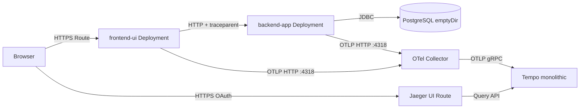

# OpenShift 4.18 Observability Demo — 3-Layer App, Tempo, Collector & Jaeger UI

Guide to deploy a **three-layer traceable demo** on **OpenShift Container Platform 4.18**: **frontend UI** (Spring MVC + Thymeleaf), **backend monolith** (Spring Boot + JPA + PostgreSQL), **PostgreSQL** (ephemeral `emptyDir` only), plus **TempoMonolithic**, **Red Hat build of OpenTelemetry Collector**, and **Jaeger UI** (query against Tempo). Application images are built **in-cluster** via **`BuildConfig`** + Git. **No Helm, no Argo CD, no PVCs.**

Manifests live in **`openshift/`** in [github.com/sawoohoorun/ocp-observ-monolithic](https://github.com/sawoohoorun/ocp-observ-monolithic). This document describes **purpose**, **order of apply**, and **commands** — not full YAML dumps.

---

## Architecture Summary



- **Two OpenTelemetry producers** (`frontend-ui`, `backend-app`) → same **Collector** → **Tempo** → **Jaeger UI** (Tempo-backed query).
- **PostgreSQL** stores demo rows only; traces are **not** in Postgres.

---

## Upgraded 3-Layer Application Architecture

| Layer | Workload | Responsibility |
|-------|----------|----------------|
| **1 — Frontend UI** | `frontend-ui` | Serves HTML with **Get Order / Check Inventory / Calculate Price** actions. Each action performs a **server-side** `RestClient` call to `backend-app` so **W3C `traceparent`** propagates on the outbound HTTP request. |
| **2 — Backend monolith** | `backend-app` | REST `/api/...`, **controller** spans (auto), **service** spans (manual + business logic), **database client** spans (manual `SpanKind.CLIENT` around JPA reads + `db.*` attributes). |
| **3 — Data** | `postgres` | Single non-HA **Deployment**, **`emptyDir`** data volume, **init SQL** via ConfigMap → `docker-entrypoint-initdb.d`. |

---

## Frontend UI Design

- **Stack:** Spring Boot **3.4**, **Thymeleaf** (server-side rendering — no browser JS tracing required for the demo).
- **Service name:** `spring.application.name: frontend-ui` → **`service.name`** in exported traces.
- **Outbound calls:** `RestClient` to `demo.backend-base-url` (overridden in-cluster by **`DEMO_BACKEND_BASE_URL`** → `http://backend-app.observability-demo.svc.cluster.local:8080`).
- **User actions:** Links such as `/action/order/ORD-001`, `/action/inventory/SKU-100`, `/action/pricing/SKU-100` each trigger one backend round-trip and **one distributed trace** spanning UI + API + DB.

---

## Backend Monolith Design

- **Stack:** Spring Web, Actuator, **Data JPA**, **PostgreSQL** driver, **Micrometer tracing bridge → OTLP**.
- **Service name:** `backend-app`.
- **APIs:** `GET /api/orders/{id}`, `GET /api/inventory/{sku}`, `GET /api/pricing/{sku}`.
- **Layers:** `ApiController` → `OrderService` / `InventoryService` / `PricingService` → JPA repositories → PostgreSQL.
- **DSN:** `jdbc:postgresql://postgres.observability-demo.svc.cluster.local:5432/demodb` with password from **`DB_PASSWORD`** (Secret).

---

## PostgreSQL Demo Layer

- **Image:** `docker.io/library/postgres:16-alpine` (if your cluster blocks Docker Hub, mirror or substitute a Red Hat–compatible image and update **`openshift/40-postgres.yaml`**).
- **Storage:** **`emptyDir`** only at `/var/lib/postgresql/data` — data is **lost** when the pod is deleted.
- **Bootstrap:** ConfigMap **`postgres-init`** mounted as **`/docker-entrypoint-initdb.d`**; creates `orders`, `inventory`, `pricing` and seeds **`ORD-001`**, **`SKU-100`**, etc.
- **Credentials:** Secret **`postgres-secret`** (referenced by Deployment and backend).

---

## Cross-Service Trace Propagation

1. **Browser → frontend-ui:** vanilla HTTP GET; Tomcat/Spring creates the **root server span** for `/action/...` on **`frontend-ui`**.
2. **frontend-ui → backend-app:** **`RestClient`** runs in the same request thread; Spring Boot observability injects **`traceparent`** (W3C) on the outbound request. The backend’s Tomcat creates a **child server span** linked to the same trace.
3. **backend-app internal:** Service-layer manual spans and DB client spans attach **under** the backend HTTP span.
4. **Export:** Both apps send OTLP **HTTP** to **`http://otel-collector.observability-demo.svc.cluster.local:4318/v1/traces`**.

---

## Database Span Visibility in Jaeger

- **Approach:** **Manual OpenTelemetry spans** (`SpanKind.CLIENT`) named e.g. **`SELECT orders`**, **`SELECT inventory`**, **`SELECT pricing`**, with attributes **`db.system=postgresql`**, **`db.statement`**, **`db.sql.table`**.
- **Why manual:** Guarantees a **visible SQL-layer span** in Jaeger for lab validation. Pure JPA/Micrometer JDBC auto-instrumentation varies by version; if those spans appear **in addition**, they are a bonus.
- **Missing DB spans:** If you see backend HTTP + service spans but **no** `SELECT *` client spans, check **`OrderService`** / **`InventoryService`** / **`PricingService`** in `backend-app` or verify the deployment is running the expected image.

---

## OCP 4.18 Assumptions

- Connected cluster, **`redhat-operators`**, **OperatorHub** for Path B.
- **`cluster-admin`** for operators and **`observability-demo`**.
- Build pods: Git + Maven Central; app pods: pull **internal registry** + optional **docker.io** for Postgres.
- **Restricted** PSA on `observability-demo` (manifests use non-root, dropped caps, `emptyDir` `/tmp` for Java apps).

---

## Existing Source Code Assessment

The repository is the application source:

- **`frontend-ui/`** — Thymeleaf UI + `RestClient` to backend.
- **`backend-app/`** — REST API, JPA entities/repositories, traced services.
- **`openshift/`** — All deploy/build/operator operand YAML for this demo.

The previous single **`spring-monolith`** tree was **removed** in favor of this split.

---

## Repository Structure Summary

```text
├── backend-app/           # Maven, Spring Boot API + JPA
├── frontend-ui/           # Maven, Spring Boot + Thymeleaf
├── openshift/             # Namespaces, operators, Tempo, Collector, Postgres, builds, Deployments, Routes
├── OCP-4.18-Observability-Demo-Deployment.md
└── README.md              # kept in sync with this guide
```

---

## What Changed in the Application Code

| Area | Change | Why |
|------|--------|-----|
| **Layout** | Replaced single `spring-monolith` with **`frontend-ui/`** + **`backend-app/`** | Separate deployments, routes, and **`service.name`** values for Jaeger. |
| **Manifests** | Moved to **`openshift/`** with numbered files (`20`–`40`) | Matches OpenShift-focused layout you requested. |
| **Backend** | JPA + Postgres + manual **DB client spans** | Satisfy **Layer 3** visibility in Jaeger. |
| **Frontend** | New Thymeleaf app + **`RestClient`** | **Layer 1** server span + **HTTP client** span to backend with **W3C** propagation. |
| **Postgres** | New `40-postgres.yaml` | Ephemeral DB with seed data; **no PVC**. |

---

## File Tree

```text
openshift/
├── 00-namespace.yaml
├── 01-operatorgroup.yaml
├── 02-subscriptions.yaml
├── 10-tempo.yaml
├── 11-otel-collector.yaml
├── 20-ui-buildconfig.yaml      # ImageStream + BuildConfig (frontend-ui)
├── 21-ui-deployment.yaml
├── 22-ui-service.yaml
├── 23-ui-route.yaml
├── 30-backend-buildconfig.yaml # ImageStream + BuildConfig (backend-app)
├── 31-backend-deployment.yaml
├── 32-backend-service.yaml
├── 40-postgres.yaml            # Secret, ConfigMap, Service, Deployment
└── 30-smoketest.md
```

---

## File Purpose Summary

| File | Purpose |
|------|---------|
| `00-namespace.yaml` | Operator + `observability-demo` namespaces. |
| `01-operatorgroup.yaml` | OperatorGroups for Tempo + OpenTelemetry operators. |
| `02-subscriptions.yaml` | `tempo-product`, `opentelemetry-product` subscriptions. |
| `10-tempo.yaml` | `TempoMonolithic` + **Jaeger UI Route** + memory storage. |
| `11-otel-collector.yaml` | `OpenTelemetryCollector` OTLP in → Tempo gRPC out. |
| `20-ui-buildconfig.yaml` | Git `contextDir: frontend-ui` → image **`frontend-ui:1.0.0`**. |
| `21–23` | UI Deployment (OTLP + backend URL env), Service, **edge Route** (user-facing). |
| `30-backend-buildconfig.yaml` | Git `contextDir: backend-app` → **`backend-app:1.0.0`**. |
| `31–32` | Backend Deployment (`DB_PASSWORD` from Secret), ClusterIP **Service** (cluster-only). |
| `40-postgres.yaml` | Postgres **emptyDir**, init schema/data, **Secret** password. |

**Edit if needed:** `spec.source.git` in both `BuildConfig`s for forks/branches; Postgres **image** in `40-postgres.yaml` if Docker Hub is blocked.

---

## Prerequisites

- `oc` CLI, cluster-admin (install), pull secrets if using private registries.
- Resource headroom: Tempo + Collector + Postgres + 2 Java pods + build pods.

---

## Deployment Option Matrix

| Step | Path A — CLI | Path B — Console |
|------|--------------|------------------|
| Operators | `oc apply -f openshift/00–02` | OperatorHub → Tempo + OpenTelemetry |
| Operands + apps | `oc apply` + `oc start-build` | Same after CSV **Succeeded** |

---

## Operator Installation Steps

```bash
oc apply -f openshift/00-namespace.yaml
oc apply -f openshift/01-operatorgroup.yaml
oc apply -f openshift/02-subscriptions.yaml
oc get csv -n openshift-tempo-operator
oc get csv -n openshift-opentelemetry-operator
```

Wait for **`Succeeded`**.

---

## Observability Stack Deployment Steps

```bash
oc apply -f openshift/10-tempo.yaml
oc apply -f openshift/11-otel-collector.yaml
```

Jaeger UI is enabled on **`TempoMonolithic`** (`spec.jaegerui.enabled` + `route.enabled`). List routes: `oc get routes -n observability-demo`.

---

## Application Build Steps Using OpenShift Build / S2I

**Strategy:** **Docker** `BuildConfig` + Git (multi-stage `Dockerfile` + Maven Wrapper in each app) — same rationale as before: **Java 21**, reproducible builds, no pre-committed `target/`.

1. **PostgreSQL first** (schema before backend):

   ```bash
   oc apply -f openshift/40-postgres.yaml
   oc rollout status deployment/postgres -n observability-demo --timeout=300s
   ```

2. **Register builds & start** (order flexible; backend is often built first):

   ```bash
   oc apply -f openshift/30-backend-buildconfig.yaml
   oc apply -f openshift/20-ui-buildconfig.yaml
   oc start-build backend-app -n observability-demo --follow
   oc start-build frontend-ui -n observability-demo --follow
   ```

3. **Inspect:**

   ```bash
   oc get builds -n observability-demo
   oc describe is backend-app -n observability-demo
   oc describe is frontend-ui -n observability-demo
   ```

---

## Application Deployment Steps

```bash
oc apply -f openshift/32-backend-service.yaml
oc apply -f openshift/31-backend-deployment.yaml
oc rollout status deployment/backend-app -n observability-demo --timeout=300s

oc apply -f openshift/22-ui-service.yaml
oc apply -f openshift/23-ui-route.yaml
oc apply -f openshift/21-ui-deployment.yaml
oc rollout status deployment/frontend-ui -n observability-demo --timeout=300s

oc get route frontend-ui -n observability-demo -o jsonpath='{.spec.host}{"\n"}'
```

Apply **Deployments only after** images exist (or expect short `ImagePullBackOff` until builds finish).

---

## OpenTelemetry in Code

### 1. Frontend UI tracing

- **Inbound:** Spring MVC / Tomcat creates a **server span** for each `/action/...` request (`frontend-ui`).
- **Outbound:** **`RestClient`** is instrumented by Spring Boot 3 + Micrometer tracing; **`traceparent`** (W3C) is sent to **`backend-app`**. No browser JS instrumentation is required because the **browser only loads HTML**; tracing starts at the **frontend pod** when the user follows a link.

### 2. Backend app tracing

- **Controller:** Auto **HTTP server** spans for `/api/...`.
- **Service:** Manual spans **`OrderService.getOrder`**, **`InventoryService.checkStock`**, **`PricingService.getPrice`**.
- **Repository / DB:** Manual **client** spans **`SELECT orders`**, **`SELECT inventory`**, **`SELECT pricing`** wrapping JPA calls, with **`db.system`**, **`db.statement`**, etc.

### 3. Database spans in Jaeger

- Implemented as **OpenTelemetry client spans** (see **Database Span Visibility in Jaeger**). Hibernate may add additional internal spans depending on version; the manual spans are the **contract** for the lab.

### 4. Trace propagation

- **W3C Trace Context** on the HTTP call **frontend → backend** via Spring’s propagators.
- **Single trace** should chain: frontend server → frontend client → backend server → service → DB client.

### 5. Service naming

- **`frontend-ui`** — `spring.application.name` in `frontend-ui`.
- **`backend-app`** — `spring.application.name` in `backend-app`.
- **Postgres-related spans** — same trace as backend; span attributes carry **`db.system=postgresql`** (resource/service still typically **`backend-app`** unless you add peer service attributes).

**OTLP:** `MANAGEMENT_OTLP_TRACING_ENDPOINT=http://otel-collector.observability-demo.svc.cluster.local:4318/v1/traces` on both Deployments.

---

## Jaeger UI Enablement

- Configured on **`TempoMonolithic`** in `openshift/10-tempo.yaml` (`jaegerui.enabled`, `route.enabled`).
- **Jaeger UI does not store traces** here — it **queries Tempo**.
- Access: **Route** in `observability-demo` (plus OAuth). Fallback: `oc port-forward` to the Jaeger UI / query **Service** if routes are restricted.

---

## Tracing Testing

End-to-end validation checklist:

1. **Open** the **`frontend-ui`** Route in a browser (`oc get route frontend-ui -n observability-demo`).
2. **Click** **Get Order** (or Inventory / Price) — each click starts a **new trace**.
3. **Open Jaeger UI** Route (same namespace); select service **`frontend-ui`** and/or **`backend-app`**.
4. **Find** a trace matching the click time; root is often the **frontend** HTTP span.
5. **Confirm spans:**
   - **Frontend:** HTTP server for `/action/...`; HTTP **client** to `/api/...`.
   - **Backend:** HTTP server for `/api/...`; **`OrderService.*`** / **`InventoryService.*`** / **`PricingService.*`**; **`SELECT ...`** **client** spans with **`db.system=postgresql`**.
6. **Collector sanity:** `oc logs -n observability-demo -l app.kubernetes.io/name=otel-collector --tail=80`.
7. **If no traces:** See **Troubleshooting**; verify OTLP env on both Deployments, Collector + Tempo pods, and that Postgres is **Ready** before heavy backend traffic.
8. **Load (optional):** repeat clicks or script `curl` against the **frontend** Route (session-less links).

---

## UI Click Trace Testing

1. Browse to **`https://<frontend-ui-route-host>/`**.
2. Click **Get Order** → expect JSON-like payload for **`ORD-001`** on the result page.
3. In Jaeger, find a trace where the **first span** is associated with **`frontend-ui`** and path **`/action/order/ORD-001`** (names may vary slightly by instrumentation).
4. Expand children until you see **`backend-app`** **HTTP** span for **`GET /api/orders/ORD-001`**.
5. Under that, confirm **service** + **`SELECT orders`** (or equivalent) span.
6. Repeat for **Check Inventory** (`SKU-100`) and **Calculate Price** (`SKU-100`).

---

## Jaeger Waterfall Interpretation

- **Top to bottom:** Time flows downward; **width** ≈ duration.
- **Expected shape (Get Order):**  
  **frontend-ui** server (wide) contains **frontend-ui** client (narrower) → **backend-app** server → **OrderService.getOrder** → **`SELECT orders`** (often short but visible).
- **Latency:** Sum of **network + JVM + JDBC + Postgres**; DB span width is **query + round-trip**; missing widening in DB layer may mean the query is fast or the span is missing (see **Database Span Visibility**).
- **Missing DB span:** Usually **instrumentation** not reaching JPA (here mitigated by **manual** spans); if **only** auto-instrumentation were used, missing JDBC spans would point to disabled observations or unsupported stack.

---

## Verification Steps

| Goal | Command / action |
|------|------------------|
| Operators | `oc get csv -n openshift-tempo-operator` ; `oc get csv -n openshift-opentelemetry-operator` |
| Tempo / Collector | `oc get tempomonolithic,pods,opentelemetrycollector -n observability-demo` |
| Postgres | `oc get pods -l app.kubernetes.io/name=postgres -n observability-demo` ; `oc logs deploy/postgres -n observability-demo --tail=20` |
| Backend | `oc get pods -l app.kubernetes.io/name=backend-app -n observability-demo` ; `curl -sS http://$(oc get svc backend-app -o jsonpath='{.spec.clusterIP}' -n observability-demo):8080/api/orders/ORD-001` from a debug pod or port-forward |
| Frontend route | `oc get route frontend-ui -n observability-demo` |
| UI smoke | Browser: click all three actions |
| Jaeger | **Tracing Testing** + **UI Click Trace Testing** |
| Different `service.name` | Filter by **`frontend-ui`** vs **`backend-app`** in Jaeger service list |

---

## Expected Trace Flow

**One user click (e.g. Get Order):**

1. **frontend-ui** — Server span for `/action/order/ORD-001`.  
2. **frontend-ui** — Client span → **backend-app** `/api/orders/ORD-001`.  
3. **backend-app** — Server span for API.  
4. **backend-app** — `OrderService.getOrder` + **`SELECT orders`** (DB client).  

Minimum **three logical layers** visible: **UI pod**, **API pod**, **database client span**.

---

## Troubleshooting

| Issue | Notes |
|-------|--------|
| Tempo apply **warnings** (multitenancy / `extraConfig`) | See earlier doc revision / Red Hat guidance; lab uses single-tenant **TempoMonolithic** + Jaeger OAuth on the UI Route. |
| Postgres **CrashLoop** on restricted SCC | Try adjusting **image** or **securityContext** per cluster policy; ensure **`emptyDir`** and `PGDATA` subpath as in `40-postgres.yaml`. |
| **ImagePullBackOff** for `postgres:16-alpine` | Use an internal mirror or Red Hat image; update `40-postgres.yaml`. |
| Backend **unready** | Postgres not ready, wrong password, or DB not initialized — check `oc logs deploy/backend-app`. |
| **No DB spans** | Confirm backend image includes **manual** spans in services; check Jaeger for collapsed child spans. |
| **`debug` exporter** errors on Collector | Switch **`debug`** → **`logging`** in `11-otel-collector.yaml` pipeline. |

---

## Cleanup

```bash
oc delete -f openshift/23-ui-route.yaml --ignore-not-found
oc delete -f openshift/22-ui-service.yaml --ignore-not-found
oc delete -f openshift/21-ui-deployment.yaml --ignore-not-found
oc delete -f openshift/32-backend-service.yaml --ignore-not-found
oc delete -f openshift/31-backend-deployment.yaml --ignore-not-found
oc delete -f openshift/30-backend-buildconfig.yaml --ignore-not-found
oc delete -f openshift/20-ui-buildconfig.yaml --ignore-not-found
oc delete -f openshift/40-postgres.yaml --ignore-not-found
oc delete -f openshift/11-otel-collector.yaml --ignore-not-found
oc delete -f openshift/10-tempo.yaml --ignore-not-found
oc delete project observability-demo
```

---

## Apply All

```bash
oc apply -f openshift/00-namespace.yaml
oc apply -f openshift/01-operatorgroup.yaml
oc apply -f openshift/02-subscriptions.yaml
# wait for CSVs Succeeded
oc apply -f openshift/10-tempo.yaml
oc apply -f openshift/11-otel-collector.yaml
oc apply -f openshift/40-postgres.yaml
oc rollout status deployment/postgres -n observability-demo --timeout=300s
oc apply -f openshift/30-backend-buildconfig.yaml
oc apply -f openshift/20-ui-buildconfig.yaml
```

Then **build images** (see below), then:

```bash
oc apply -f openshift/32-backend-service.yaml
oc apply -f openshift/31-backend-deployment.yaml
oc apply -f openshift/22-ui-service.yaml
oc apply -f openshift/23-ui-route.yaml
oc apply -f openshift/21-ui-deployment.yaml
```

---

## Build and Deploy App

```bash
oc start-build backend-app -n observability-demo --follow
oc start-build frontend-ui -n observability-demo --follow
oc rollout status deployment/backend-app -n observability-demo --timeout=300s
oc rollout status deployment/frontend-ui -n observability-demo --timeout=300s
```

---

## Web Console Install Path

**Tempo Operator:** **Administrator** → **Operators** → **OperatorHub** → search **Tempo** → **Install** → **`openshift-tempo-operator`**, **stable**, **Automatic**.

**Red Hat build of OpenTelemetry:** **OperatorHub** → **Red Hat build of OpenTelemetry** → **`openshift-opentelemetry-operator`**, **stable**, **Automatic**.

Then apply **`openshift/10-tempo.yaml`**, **`11-otel-collector.yaml`**, and the rest via CLI as above.

---

## Tracing Test Quickstart

```bash
HOST=$(oc get route frontend-ui -n observability-demo -o jsonpath='{.spec.host}')
open "https://${HOST}/"
# Click "Get Order", then open Jaeger UI route → service frontend-ui / backend-app → Find Traces
```

---

## OpenTelemetry in Code (recap)

- **frontend-ui** + **backend-app**: Micrometer **OTLP HTTP** → **`otel-collector.observability-demo.svc.cluster.local:4318`**.  
- **Propagation:** **W3C** on **RestClient** from UI to API.  
- **DB:** **Manual** `SpanKind.CLIENT` spans with **`db.*`** attributes on **`backend-app`**.  
- **Jaeger:** Queries **Tempo**; filter **`frontend-ui`** vs **`backend-app`** for layer proof.
