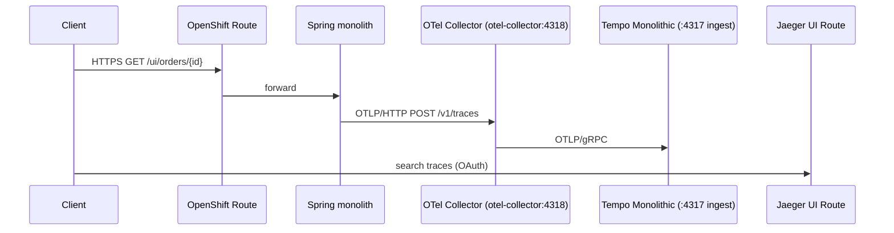

# OpenShift Container Platform 4.18 — Observability Lab (Tempo + OpenTelemetry + This Repository’s Spring Monolith)

This guide deploys a **real, versioned application** from the Git repository **[https://github.com/sawoohoorun/ocp-observ-monolithic](https://github.com/sawoohoorun/ocp-observ-monolithic)** on **OpenShift Container Platform 4.18**, together with **Red Hat OpenShift distributed tracing (Tempo Operator)**, **Red Hat build of OpenTelemetry Operator**, and an in-cluster **OpenTelemetry Collector**. Traces flow **OTLP (HTTP)** from the app → **Collector** → **OTLP (gRPC)** → **TempoMonolithic** (in-memory, **no PVC**). Application images are built **inside the cluster** using an OpenShift **`BuildConfig`** (**Docker** strategy + **Git** source).

---

## Architecture summary

| Layer | Namespace | What runs |
|-------|-----------|-----------|
| Tempo Operator | `openshift-tempo-operator` | OLM subscription, operator pods |
| OpenTelemetry Operator | `openshift-opentelemetry-operator` | OLM subscription, operator pods |
| Demo workloads | `observability-demo` | `TempoMonolithic` (memory backend), `OpenTelemetryCollector`, `BuildConfig` / `ImageStream`, Spring Boot `Deployment`, `Service`, `Route` |

**Trace path**



**Why `TempoMonolithic` (not `TempoStack`)**  
`TempoStack` targets object storage and often PVC-backed ingesters. This lab requires **no PVCs** and **ephemeral** trace storage. `TempoMonolithic` with `spec.storage.traces.backend: memory` uses a bounded **tmpfs** volume (lost on pod restart), which matches a demo/lab.

**Why Docker `BuildConfig` + Git (vs classic S2I only)**  
The application uses **Java 21** and Spring Boot **3.4.x**. A **multi-stage `Dockerfile`** (UBI 9 OpenJDK 21 + **Maven Wrapper**) compiles the project during the OpenShift build without relying on a pre-populated `target/` directory in Git. Many clusters expose `openshift/java` image stream tags only for **Java 17**; Docker strategy with this Dockerfile is **portable** and still **100% in-cluster**. An **optional Source-to-Image** `BuildConfig` is documented for clusters that expose a suitable **Java 21** S2I builder.

---

## OCP 4.18-specific assumptions

- Connected cluster (or equivalent) with **`redhat-operators`** catalog in `openshift-marketplace`.
- `cluster-admin` (or equivalent) for operator install and namespace creation.
- **Git over HTTPS** to `github.com` allowed from build pods (for `BuildConfig` clone). For a **private fork**, add a **source** `Secret` and reference it in `BuildConfig.spec.source`.
- **Pod Security** restricted profile in `observability-demo` (labels on namespace).
- **OperatorHub** terminology for web-console operator install on 4.18.

---

## Existing source code assessment

The demo application **is** this repository. The runnable service lives under:

`observability-demo-ocp418/spring-monolith/`

It is a **single** Spring Boot application (monolith) with:

- **HTTP API**: `GET /ui/orders/{id}` (`OrderController`) — “frontend-style” entry.
- **Business layer**: `OrderService.getOrder` with a **manual OpenTelemetry span**.
- **Integration layer**: `InventoryClient` / `PricingClient` using **Spring `RestClient`** to **loopback** internal controllers (`InternalApiController`) — produces **client + server HTTP spans** in the **same trace** when context propagates.

Observability stack manifests and docs live under `observability-demo-ocp418/*.yaml`.

---

## Repository structure summary

```text
ocp-observ-monolithic/
├── OCP-4.18-Observability-Demo-Deployment.md   # this guide
├── README.md                                    # copy of this guide (kept in sync)
└── observability-demo-ocp418/
    ├── 00-namespace.yaml
    ├── 01-operatorgroup.yaml
    ├── 02-subscriptions.yaml
    ├── 10-tempo.yaml
    ├── 11-otel-collector.yaml
    ├── 20-app-imagestream.yaml
    ├── 21-app-buildconfig.yaml
    ├── 22-app-configmap.yaml
    ├── 23-app-deployment.yaml
    ├── 24-app-service.yaml
    ├── 25-app-route.yaml
    ├── 30-smoketest.md
    └── spring-monolith/                         # application source (Maven)
        ├── pom.xml
        ├── Dockerfile
        ├── mvnw, mvnw.cmd
        ├── .mvn/wrapper/
        ├── .s2i/environment                    # optional S2I builds
        └── src/main/java/.../demo/
```

---

## What changed in the application code (delta)

| Change | File(s) | Why |
|--------|---------|-----|
| **Added** | `mvnw`, `mvnw.cmd`, `.mvn/wrapper/*` | **Maven Wrapper** so the OpenShift **Docker** build can run `./mvnw package` without installing Maven in the base image via yum. |
| **Replaced** | `Dockerfile` | **Multi-stage** build: stage 1 compiles with the wrapper; stage 2 runs the fat JAR on UBI OpenJDK 21. The old single-stage file assumed `target/*.jar` already existed (not true for Git-only builds). |
| **Added** | `.s2i/environment` | Documents `MAVEN_ARGS_APPEND=-DskipTests` for an **optional** Red Hat **Java S2I** `BuildConfig` (not used by default). |
| **Unchanged (baseline)** | `pom.xml`, `application.yaml`, Java packages under `com.example.demo` | Already declare Micrometer OTel bridge, OTLP exporter, actuator probes, and layered spans. |

No unrelated sample application was introduced; the lab tracks **this** repo.

---

## File tree (manifests + app)

```text
observability-demo-ocp418/
├── 00-namespace.yaml
├── 01-operatorgroup.yaml
├── 02-subscriptions.yaml
├── 10-tempo.yaml
├── 11-otel-collector.yaml
├── 20-app-imagestream.yaml
├── 21-app-buildconfig.yaml
├── 22-app-configmap.yaml
├── 23-app-deployment.yaml
├── 24-app-service.yaml
├── 25-app-route.yaml
├── 30-smoketest.md
└── spring-monolith/
    ├── pom.xml
    ├── Dockerfile
    ├── mvnw
    ├── mvnw.cmd
    ├── .mvn/wrapper/maven-wrapper.properties
    ├── .s2i/environment
    └── src/main/java/com/example/demo/...
```

---

## Prerequisites

- `oc` CLI (4.18-compatible), logged in as a user who can install operators and create projects.
- Cluster pull access to **Red Hat registries** used by the Dockerfile (`registry.access.redhat.com/ubi9/openjdk-21`).
- Build pods must reach **Maven Central** (or your mirror) because the Maven Wrapper downloads the Maven distribution (`distributionUrl` in `maven-wrapper.properties`).

---

## Deployment option matrix

| Step | Path A — CLI-first | Path B — Web console hybrid |
|------|--------------------|------------------------------|
| Projects / namespaces | `oc apply -f 00-namespace.yaml` | Same, or create `observability-demo` in UI |
| Tempo Operator | `oc apply -f 01-operatorgroup.yaml 02-subscriptions.yaml` (tempo subscription) | OperatorHub → install Tempo Operator |
| OpenTelemetry Operator | Same subscriptions file | OperatorHub → install Red Hat build of OpenTelemetry |
| Tempo + Collector CRs | `oc apply -f 10-tempo.yaml 11-otel-collector.yaml` | Same |
| App image + deploy | `BuildConfig` + `oc start-build` + manifests | Same; builds also visible under **Builds** in console |

---

## Path A — Operator installation (CLI)

```bash
oc apply -f observability-demo-ocp418/00-namespace.yaml
oc apply -f observability-demo-ocp418/01-operatorgroup.yaml
oc apply -f observability-demo-ocp418/02-subscriptions.yaml
```

Wait for CSVs:

```bash
oc get csv -n openshift-tempo-operator
oc get csv -n openshift-opentelemetry-operator
```

Expect **`tempo-product`** and **`opentelemetry-product`** in **Succeeded**.

---

## Path B — Operator installation (web console)

### Tempo Operator

1. **Administrator** perspective.  
2. **Operators** → **OperatorHub**.  
3. Search **Tempo** / **distributed tracing**.  
4. Choose **Tempo Operator** (Red Hat).  
5. **Install** → **All namespaces on the cluster** → installed namespace **`openshift-tempo-operator`** → channel **`stable`** → **Automatic** → **Install**.

### Red Hat build of OpenTelemetry Operator

1. **Operators** → **OperatorHub**.  
2. Search **Red Hat build of OpenTelemetry**.  
3. **Install** → **All namespaces** → **`openshift-opentelemetry-operator`** → **`stable`** → **Automatic** → **Install**.

Then apply operand YAML with CLI:

```bash
oc apply -f observability-demo-ocp418/10-tempo.yaml
oc apply -f observability-demo-ocp418/11-otel-collector.yaml
```

---

## Observability stack deployment (CLI)

```bash
oc apply -f observability-demo-ocp418/10-tempo.yaml
oc apply -f observability-demo-ocp418/11-otel-collector.yaml
```

**Collector OTLP HTTP endpoint (in-cluster DNS)** used by the app:

`http://otel-collector.observability-demo.svc.cluster.local:4318`

**Tempo OTLP gRPC ingest** (collector exporter target):

`tempo-demo.observability-demo.svc.cluster.local:4317`

---

## Application build steps (OpenShift build — in cluster)

### 1. Create / ensure project

Already included in `00-namespace.yaml` for `observability-demo`. If you created the project separately:

```bash
oc project observability-demo
```

### 2. Import manifest resources (ImageStream, BuildConfig, supporting objects)

```bash
cd observability-demo-ocp418
oc apply -f 20-app-imagestream.yaml
oc apply -f 21-app-buildconfig.yaml
oc apply -f 22-app-configmap.yaml
oc apply -f 24-app-service.yaml
oc apply -f 25-app-route.yaml
```

(`Deployment` is applied **after** the first successful build so the image tag exists; see below.)

### 3. Source repository reference

`21-app-buildconfig.yaml` pins:

- **URI**: `https://github.com/sawoohoorun/ocp-observ-monolithic.git`  
- **ref**: `main`  
- **contextDir**: `observability-demo-ocp418/spring-monolith`

To use a **fork**, edit `spec.source.git.uri` (and `ref`) in `21-app-buildconfig.yaml`, or `oc patch` / re-apply.

### 4. Start the build and watch logs

```bash
oc start-build demo-monolith -n observability-demo --follow
```

### 5. Inspect build and image

```bash
oc get builds -n observability-demo
oc describe build demo-monolith-1 -n observability-demo
oc logs -n observability-demo -f build/demo-monolith-1
oc describe is demo-monolith -n observability-demo
oc get is demo-monolith -n observability-demo -o wide
```

### 6. Deploy the built image

After **Complete**:

```bash
oc apply -f 23-app-deployment.yaml
oc rollout status deployment/demo-monolith -n observability-demo --timeout=300s
```

The `Deployment` uses an **ImageStreamTag** trigger annotation so future rebuilds of `demo-monolith:1.0.0` can roll out automatically.

### 7. Expose application (already declarative)

`24-app-service.yaml` and `25-app-route.yaml` define **ClusterIP** service and **edge-terminated Route**.

```bash
oc get route demo-monolith -n observability-demo -o jsonpath='{.spec.host}{"\n"}'
```

### Web console — build

**Administrator** → **Builds** → **BuildConfigs** → project **`observability-demo`** → **demo-monolith** → **Start Build** → view **Logs**.

---

## Docker vs Source-to-Image (explanation)

- **Default in repo**: **Docker** `BuildConfig` + **Git** source + multi-stage **`Dockerfile`**. Reason: **Java 21** + reproducible build using **Maven Wrapper** without depending on `openshift/java:21` existing on every cluster.
- **Optional S2I**: If your cluster provides **`java:21`** (or another Java 21-capable Red Hat S2I builder) in the **`openshift`** namespace, you can add a second `BuildConfig` with **`sourceStrategy`** and builder `ImageStreamTag` `java:21`. The repo includes **`.s2i/environment`** with `MAVEN_ARGS_APPEND=-DskipTests` for that pattern.

**Optional S2I `BuildConfig` fragment** (separate name to avoid clashing with the Docker-based BC):

```yaml
apiVersion: build.openshift.io/v1
kind: BuildConfig
metadata:
  name: demo-monolith-s2i
  namespace: observability-demo
spec:
  source:
    type: Git
    git:
      uri: https://github.com/sawoohoorun/ocp-observ-monolithic.git
      ref: main
    contextDir: observability-demo-ocp418/spring-monolith
  strategy:
    type: Source
    sourceStrategy:
      from:
        kind: ImageStreamTag
        name: java:21
        namespace: openshift
  output:
    to:
      kind: ImageStreamTag
      name: demo-monolith:1.0.0
```

Verify tags first: `oc get is -n openshift java` (or your platform’s documented Java S2I image stream).

---

## Full manifest files

### `00-namespace.yaml`

```yaml
---
apiVersion: v1
kind: Namespace
metadata:
  name: openshift-tempo-operator
  labels:
    openshift.io/cluster-monitoring: "true"
---
apiVersion: v1
kind: Namespace
metadata:
  name: openshift-opentelemetry-operator
  labels:
    openshift.io/cluster-monitoring: "true"
---
apiVersion: v1
kind: Namespace
metadata:
  name: observability-demo
  labels:
    app.kubernetes.io/part-of: observability-demo
    pod-security.kubernetes.io/enforce: restricted
    pod-security.kubernetes.io/audit: restricted
    pod-security.kubernetes.io/warn: restricted
```

### `01-operatorgroup.yaml`

```yaml
---
apiVersion: operators.coreos.com/v1
kind: OperatorGroup
metadata:
  name: tempo-operator-group
  namespace: openshift-tempo-operator
spec: {}
---
apiVersion: operators.coreos.com/v1
kind: OperatorGroup
metadata:
  name: opentelemetry-operator-group
  namespace: openshift-opentelemetry-operator
spec: {}
```

### `02-subscriptions.yaml`

```yaml
---
apiVersion: operators.coreos.com/v1alpha1
kind: Subscription
metadata:
  name: tempo-product
  namespace: openshift-tempo-operator
  labels:
    operators.coreos.com/tempo-product.openshift-tempo-operator: ""
spec:
  channel: stable
  installPlanApproval: Automatic
  name: tempo-product
  source: redhat-operators
  sourceNamespace: openshift-marketplace
---
apiVersion: operators.coreos.com/v1alpha1
kind: Subscription
metadata:
  name: opentelemetry-product
  namespace: openshift-opentelemetry-operator
  labels:
    operators.coreos.com/opentelemetry-product.openshift-opentelemetry-operator: ""
spec:
  channel: stable
  installPlanApproval: Automatic
  name: opentelemetry-product
  source: redhat-operators
  sourceNamespace: openshift-marketplace
```

### `10-tempo.yaml`

```yaml
apiVersion: tempo.grafana.com/v1alpha1
kind: TempoMonolithic
metadata:
  name: demo
  namespace: observability-demo
  labels:
    app.kubernetes.io/name: tempo
    app.kubernetes.io/part-of: observability-demo
spec:
  managementState: Managed
  storage:
    traces:
      backend: memory
      size: 2Gi
  jaegerui:
    enabled: true
    route:
      enabled: true
  extraConfig:
    tempo:
      compactor:
        compaction:
          block_retention: 24h
```

### `11-otel-collector.yaml`

```yaml
apiVersion: opentelemetry.io/v1beta1
kind: OpenTelemetryCollector
metadata:
  name: otel
  namespace: observability-demo
  labels:
    app.kubernetes.io/name: otel-collector
    app.kubernetes.io/part-of: observability-demo
spec:
  mode: deployment
  replicas: 1
  resources:
    limits:
      cpu: 500m
      memory: 512Mi
    requests:
      cpu: 100m
      memory: 128Mi
  config:
    receivers:
      otlp:
        protocols:
          grpc:
            endpoint: 0.0.0.0:4317
          http:
            endpoint: 0.0.0.0:4318
    processors:
      batch: {}
    exporters:
      otlp/tempo:
        endpoint: tempo-demo.observability-demo.svc.cluster.local:4317
        tls:
          insecure: true
      debug:
        verbosity: detailed
    service:
      pipelines:
        traces:
          receivers: [otlp]
          processors: [batch]
          exporters: ["otlp/tempo", debug]
```

If **`debug`** is unsupported, under `spec.config.exporters` use **`logging`** with `loglevel: debug` and set exporters to `["otlp/tempo", logging]`.

### `20-app-imagestream.yaml`

```yaml
apiVersion: image.openshift.io/v1
kind: ImageStream
metadata:
  name: demo-monolith
  namespace: observability-demo
  labels:
    app.kubernetes.io/name: demo-monolith
    app.kubernetes.io/part-of: observability-demo
```

### `21-app-buildconfig.yaml`

```yaml
apiVersion: build.openshift.io/v1
kind: BuildConfig
metadata:
  name: demo-monolith
  namespace: observability-demo
  labels:
    app.kubernetes.io/name: demo-monolith
    app.kubernetes.io/part-of: observability-demo
spec:
  successfulBuildsHistoryLimit: 5
  failedBuildsHistoryLimit: 5
  runPolicy: Serial
  source:
    type: Git
    git:
      uri: https://github.com/sawoohoorun/ocp-observ-monolithic.git
      ref: main
    contextDir: observability-demo-ocp418/spring-monolith
  strategy:
    type: Docker
    dockerStrategy:
      dockerfilePath: Dockerfile
  output:
    to:
      kind: ImageStreamTag
      name: demo-monolith:1.0.0
  triggers:
    - type: ConfigChange
```

### `22-app-configmap.yaml`

```yaml
apiVersion: v1
kind: ConfigMap
metadata:
  name: demo-monolith-info
  namespace: observability-demo
  labels:
    app.kubernetes.io/name: demo-monolith
    app.kubernetes.io/part-of: observability-demo
data:
  README: |
    Demo monolith for OCP 4.18 observability lab (this repository).
    Primary endpoint: GET /ui/orders/{id}
    Actuator health: /actuator/health
    Build: OpenShift BuildConfig demo-monolith (Docker strategy + Git).
```

### `23-app-deployment.yaml`

```yaml
apiVersion: apps/v1
kind: Deployment
metadata:
  name: demo-monolith
  namespace: observability-demo
  labels:
    app.kubernetes.io/name: demo-monolith
    app.kubernetes.io/part-of: observability-demo
    app.kubernetes.io/component: application
  annotations:
    image.openshift.io/triggers: |-
      [{"from":{"kind":"ImageStreamTag","name":"demo-monolith:1.0.0","namespace":"observability-demo"},"fieldPath":"spec.template.spec.containers[?(@.name==\"app\")].image"}]
spec:
  replicas: 1
  selector:
    matchLabels:
      app.kubernetes.io/name: demo-monolith
  template:
    metadata:
      labels:
        app.kubernetes.io/name: demo-monolith
        app.kubernetes.io/part-of: observability-demo
        app.kubernetes.io/component: application
    spec:
      serviceAccountName: default
      securityContext:
        runAsNonRoot: true
        seccompProfile:
          type: RuntimeDefault
      containers:
        - name: app
          image: image-registry.openshift-image-registry.svc:5000/observability-demo/demo-monolith:1.0.0
          imagePullPolicy: Always
          ports:
            - name: http
              containerPort: 8080
              protocol: TCP
          env:
            - name: SERVER_PORT
              value: "8080"
            - name: MANAGEMENT_OTLP_TRACING_ENDPOINT
              value: "http://otel-collector.observability-demo.svc.cluster.local:4318/v1/traces"
            - name: MANAGEMENT_TRACING_SAMPLING_PROBABILITY
              value: "1.0"
            - name: DEMO_INTERNAL_BASE_URL
              value: "http://127.0.0.1:8080"
          readinessProbe:
            httpGet:
              path: /actuator/health/readiness
              port: http
              scheme: HTTP
            initialDelaySeconds: 15
            periodSeconds: 10
            timeoutSeconds: 3
            failureThreshold: 6
          livenessProbe:
            httpGet:
              path: /actuator/health/liveness
              port: http
              scheme: HTTP
            initialDelaySeconds: 30
            periodSeconds: 20
            timeoutSeconds: 3
            failureThreshold: 3
          resources:
            requests:
              cpu: 100m
              memory: 256Mi
            limits:
              cpu: 500m
              memory: 512Mi
          securityContext:
            allowPrivilegeEscalation: false
            capabilities:
              drop:
                - ALL
            readOnlyRootFilesystem: true
          volumeMounts:
            - name: tmp
              mountPath: /tmp
      volumes:
        - name: tmp
          emptyDir: {}
```

### `24-app-service.yaml`

```yaml
apiVersion: v1
kind: Service
metadata:
  name: demo-monolith
  namespace: observability-demo
  labels:
    app.kubernetes.io/name: demo-monolith
    app.kubernetes.io/part-of: observability-demo
spec:
  selector:
    app.kubernetes.io/name: demo-monolith
  ports:
    - name: http
      port: 8080
      targetPort: http
      protocol: TCP
  type: ClusterIP
```

### `25-app-route.yaml`

```yaml
apiVersion: route.openshift.io/v1
kind: Route
metadata:
  name: demo-monolith
  namespace: observability-demo
  labels:
    app.kubernetes.io/name: demo-monolith
    app.kubernetes.io/part-of: observability-demo
spec:
  to:
    kind: Service
    name: demo-monolith
    weight: 100
  port:
    targetPort: http
  tls:
    termination: edge
    insecureEdgeTerminationPolicy: Redirect
```

---

## Application source — key files (reference)

The full tree is in Git. Critical pieces:

**`spring-monolith/pom.xml`** — OpenTelemetry-related dependencies:

- `micrometer-tracing-bridge-otel`
- `opentelemetry-exporter-otlp`

**`spring-monolith/src/main/resources/application.yaml`**

- `spring.application.name: demo-monolith` → **`service.name`** in exported traces (via Spring Boot Micrometer OTel integration).
- `management.otlp.tracing.endpoint` → default OTLP HTTP URL (overridden in-cluster by env).
- `management.tracing.sampling.probability: 1.0`
- `demo.internal-base-url` → loopback base URL for `RestClient` (overridden by `DEMO_INTERNAL_BASE_URL` in `Deployment`).

**`Dockerfile`** (multi-stage) — builds fat JAR then runs as UID **185**.

```dockerfile
FROM registry.access.redhat.com/ubi9/openjdk-21:latest AS build
WORKDIR /workspace
USER root
COPY mvnw mvnw.cmd pom.xml ./
COPY .mvn .mvn
COPY src ./src
RUN chmod +x mvnw && ./mvnw -B -DskipTests package

FROM registry.access.redhat.com/ubi9/openjdk-21:latest
WORKDIR /app
COPY --from=build /workspace/target/demo-monolith-1.0.0.jar /app/app.jar
EXPOSE 8080
USER 185
ENV JAVA_OPTS="-XX:MaxRAMPercentage=75.0"
ENTRYPOINT ["sh", "-c", "exec java $JAVA_OPTS -jar /app/app.jar"]
```

**`.s2i/environment`** (optional S2I only)

```text
MAVEN_ARGS_APPEND=-DskipTests
```

---

## OpenTelemetry code walkthrough

1. **Dependencies** — Declared in **`pom.xml`**: `spring-boot-starter-web`, `spring-boot-starter-actuator`, **`micrometer-tracing-bridge-otel`**, **`opentelemetry-exporter-otlp`**. Spring Boot’s Micrometer tracing auto-configuration bridges to the OpenTelemetry SDK used for export.

2. **Export configuration** — **`application.yaml`** sets `management.otlp.tracing.endpoint`. In OpenShift, **`MANAGEMENT_OTLP_TRACING_ENDPOINT`** on the `Deployment` overrides it to  
   `http://otel-collector.observability-demo.svc.cluster.local:4318/v1/traces`  
   (**OTLP over HTTP**, port **4318** on the Collector `Service` **`otel-collector`**).

3. **Environment variables** — `MANAGEMENT_OTLP_TRACING_ENDPOINT`, `MANAGEMENT_TRACING_SAMPLING_PROBABILITY`, `DEMO_INTERNAL_BASE_URL`, `SERVER_PORT` (see `23-app-deployment.yaml`).

4. **Collector DNS** — Service name **`otel-collector`** (from `OpenTelemetryCollector` metadata.name **`otel`**). FQDN: **`otel-collector.observability-demo.svc.cluster.local`**.

5. **Instrumentation mix**  
   - **Automatic (Spring / Micrometer / Tomcat)**: incoming HTTP (`/ui/orders/...`, `/internal/...`), outgoing **`RestClient`** HTTP client spans.  
   - **Manual (OpenTelemetry API)**: `OrderService.getOrder` creates a named span **`OrderService.getOrder`** via injected **`Tracer`**.

6. **Where spans originate**  
   - **Controller**: `OrderController` — server span for `GET /ui/orders/{id}`.  
   - **Service**: `OrderService` — manual span `OrderService.getOrder`.  
   - **Integration**: `InventoryClient` / `PricingClient` — client spans; `InternalApiController` — server spans for internal routes.

7. **Single trace** — The manual span runs **inside** the active context created by the incoming HTTP span (`try (Scope scope = span.makeCurrent())`). `RestClient` is part of Spring Boot 3 observability and propagates **W3C trace context** on loopback calls, so client + internal server spans attach as **children** of the same trace.

8. **Context propagation** — Same JVM, loopback to `http://127.0.0.1:8080` with headers injected by instrumented `RestClient`; Tempo shows a **single trace** with multiple spans.

9. **Manual span code** — `OrderService` uses `tracer.spanBuilder("OrderService.getOrder").startSpan()` and `span.makeCurrent()` so business logic is visible even if you tune auto-instrumentation.

10. **`service.name` / resource** — From **`spring.application.name`** (`demo-monolith`) via Spring Boot’s Micrometer/OpenTelemetry resource defaults unless overridden by standard OTel resource env vars (not required here).

**`OpenTelemetryConfig`** supplies a **`Tracer`** bean backed by the auto-configured **`OpenTelemetry`** instance (falls back to noop if missing).

---

## Verification steps

| Goal | Commands |
|------|----------|
| Operators | `oc get csv -n openshift-tempo-operator` ; `oc get csv -n openshift-opentelemetry-operator` |
| Tempo CR | `oc get tempomonolithic -n observability-demo` ; `oc describe tempomonolithic demo -n observability-demo` |
| Collector | `oc get opentelemetrycollector -n observability-demo` ; `oc get pods -n observability-demo \| grep otel` |
| Build | `oc get builds -n observability-demo` ; `oc logs -n observability-demo build/<name>` |
| Image | `oc describe is demo-monolith -n observability-demo` |
| App pod | `oc get pods -n observability-demo -l app.kubernetes.io/name=demo-monolith` ; `oc describe pod -l app.kubernetes.io/name=demo-monolith -n observability-demo` |
| Route | `oc get route demo-monolith -n observability-demo` |
| Traffic | `curl -sk "https://$(oc get route demo-monolith -n observability-demo -o jsonpath='{.spec.host}')/ui/orders/5"` |
| Collector logs | `oc logs -n observability-demo -l app.kubernetes.io/name=otel-collector --tail=100` |
| Tempo / Jaeger UI | `oc get routes -n observability-demo` (Jaeger UI route created by Tempo operator); optional `oc port-forward` to query API if needed |

---

## Smoke test

See **`observability-demo-ocp418/30-smoketest.md`** (build status, curl, Jaeger UI, collector logs, Tempo pod).

---

## Expected trace flow

One trace for `GET /ui/orders/{id}` typically includes:

1. **Server** span — HTTP ingress to `/ui/orders/{id}`.  
2. **Internal** span — **`OrderService.getOrder`** (manual).  
3. **Client** span — `RestClient` `GET` to `/internal/inventory/...`.  
4. **Server** span — internal HTTP `/internal/inventory/...`.  
5. Additional **client/server** pairs for pricing (bonus).

Minimum **three** meaningful layers: ingress + business + integration.

---

## Troubleshooting

| Issue | Checks |
|-------|--------|
| Build fails cloning Git | Build pod logs; corporate proxy; private repo needs `sourceSecret`. |
| Build fails Maven download | Cluster egress to Maven Central; use mirror and custom `settings.xml` via `BuildConfig` secret if required. |
| `java:21` S2I missing | Prefer default **Docker** `BuildConfig` in this repo. |
| Image pull errors on app | Ensure build **Complete** and tag **`demo-monolith:1.0.0`** exists: `oc describe is demo-monolith -n observability-demo`. |
| No traces | Verify OTLP URL env on pod: `oc set env deployment/demo-monolith --list -n observability-demo`; collector logs; Tempo pod running. |
| `debug` exporter error | Switch collector exporter to **`logging`** (see `11-otel-collector.yaml` note). |
| Jaeger UI auth | Use OpenShift login; use `oc port-forward` for API debugging if needed. |

---

## Cleanup

```bash
oc delete -f observability-demo-ocp418/25-app-route.yaml --ignore-not-found
oc delete -f observability-demo-ocp418/24-app-service.yaml --ignore-not-found
oc delete -f observability-demo-ocp418/23-app-deployment.yaml --ignore-not-found
oc delete -f observability-demo-ocp418/22-app-configmap.yaml --ignore-not-found
oc delete -f observability-demo-ocp418/21-app-buildconfig.yaml --ignore-not-found
oc delete -f observability-demo-ocp418/20-app-imagestream.yaml --ignore-not-found
oc delete -f observability-demo-ocp418/11-otel-collector.yaml --ignore-not-found
oc delete -f observability-demo-ocp418/10-tempo.yaml --ignore-not-found
oc delete project observability-demo
# Operator uninstall (optional): delete subscriptions/csv in openshift-tempo-operator and openshift-opentelemetry-operator
```

---

## Apply All (operators + stack + app plumbing)

From the repository root (adjust paths if needed):

```bash
oc apply -f observability-demo-ocp418/00-namespace.yaml
oc apply -f observability-demo-ocp418/01-operatorgroup.yaml
oc apply -f observability-demo-ocp418/02-subscriptions.yaml
# wait for CSVs Succeeded
oc apply -f observability-demo-ocp418/10-tempo.yaml
oc apply -f observability-demo-ocp418/11-otel-collector.yaml
oc apply -f observability-demo-ocp418/20-app-imagestream.yaml
oc apply -f observability-demo-ocp418/21-app-buildconfig.yaml
oc apply -f observability-demo-ocp418/22-app-configmap.yaml
oc apply -f observability-demo-ocp418/24-app-service.yaml
oc apply -f observability-demo-ocp418/25-app-route.yaml
```

---

## Build and Deploy App

```bash
oc start-build demo-monolith -n observability-demo --follow
oc get builds -n observability-demo
oc describe is demo-monolith -n observability-demo
oc apply -f observability-demo-ocp418/23-app-deployment.yaml
oc rollout status deployment/demo-monolith -n observability-demo --timeout=300s
oc get route demo-monolith -n observability-demo
```

---

## Web Console Install Path (operators)

- **Tempo Operator**: **Administrator** → **Operators** → **OperatorHub** → search **Tempo** → **Install** → **All namespaces** → namespace **`openshift-tempo-operator`** → **stable** → **Automatic**.  
- **Red Hat build of OpenTelemetry Operator**: **OperatorHub** → search **Red Hat build of OpenTelemetry** → **Install** → **`openshift-opentelemetry-operator`** → **stable** → **Automatic**.  
- After operators succeed, apply **`10-tempo.yaml`**, **`11-otel-collector.yaml`**, and the **app** manifests as above; start the **BuildConfig** from **Builds** → **BuildConfigs** → **demo-monolith**.

---

## OpenTelemetry in Code (concise)

- **Deps**: `micrometer-tracing-bridge-otel` + `opentelemetry-exporter-otlp` in **`pom.xml`**.  
- **Export**: Spring Boot **Micrometer → OpenTelemetry** bridge sends traces to **`MANAGEMENT_OTLP_TRACING_ENDPOINT`** (OTLP HTTP) → **`otel-collector.observability-demo.svc.cluster.local:4318`**.  
- **Spans**: **Auto** for MVC + `RestClient`; **manual** `OrderService.getOrder` via **`Tracer`** from **`OpenTelemetryConfig`**.  
- **Downstream**: Collector **OTLP gRPC** to **`tempo-demo.observability-demo.svc.cluster.local:4317`**; **Jaeger UI** Route queries Tempo.

---

*Lab uses **no Helm**, **no Argo CD**, **no PVCs**. Traces in Tempo monolithic memory are **ephemeral** (lost on pod restart).*
