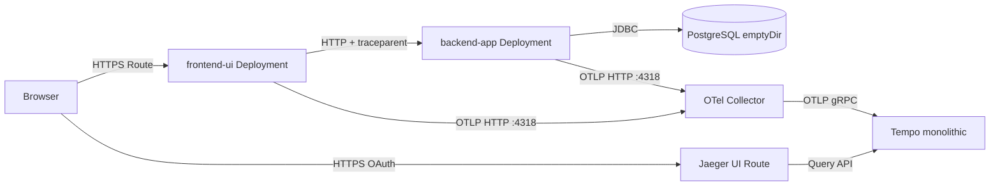
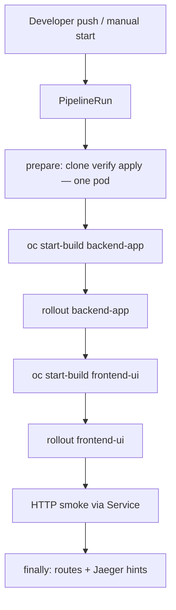

# OpenShift 4.18 Observability Demo — 3-Layer App, Tempo, Collector & Jaeger UI

Guide to deploy a **three-layer traceable demo** on **OpenShift Container Platform 4.18**: **frontend UI** (Spring MVC + Thymeleaf), **backend monolith** (Spring Boot + JPA + PostgreSQL), **PostgreSQL** (ephemeral `emptyDir` only), plus **TempoMonolithic**, **Red Hat build of OpenTelemetry Collector**, and **Jaeger UI** (query against Tempo). Application images are built **in-cluster** via **`BuildConfig`** + Git. **No Helm, no Argo CD, no PVCs.**

Manifests live in **`openshift/`** in [github.com/sawoohoorun/ocp-observ-monolithic](https://github.com/sawoohoorun/ocp-observ-monolithic). This document describes **purpose**, **order of apply**, and **commands** — not full YAML dumps.

> **Branch `single-span`:** All commands and manifests in this file use project **`observability-single-span`** (not **`observability-demo`**). Tracing layout: **`docs/single-span-tracing.md`**.

---

## Architecture Summary



- **Two OpenTelemetry producers** (`frontend-ui`, `backend-app`) → same **Collector** → **Tempo** → **Jaeger UI** (Tempo-backed query).
- **PostgreSQL** stores demo rows only; traces are **not** in Postgres.

---

## Upgraded 3-Layer Application Architecture

| Layer | Workload | Responsibility |
|-------|----------|----------------|
| **1 — Frontend UI** | `frontend-ui` | Serves HTML with **Get Order / Check Inventory / Calculate Price** actions. Each action performs a **server-side** `RestClient` call to `backend-app` so **W3C `traceparent`** propagates and **one trace ID** spans UI + API + DB (**distinct `service.name`** per tier — see **Same Trace ID Across Frontend and Backend**). |
| **2 — Backend monolith** | `backend-app` | REST `/api/...`, **controller** spans (auto), **service** spans (manual + business logic), **database client** spans (manual `SpanKind.CLIENT` around JPA reads + `db.*` attributes). |
| **3 — Data** | `postgres` | Single non-HA **Deployment**, **`emptyDir`** data volume, **init SQL** via ConfigMap → `docker-entrypoint-initdb.d`. |

---

## Frontend UI Design

- **Stack:** Spring Boot **3.4**, **Thymeleaf** (server-side rendering — no browser JS tracing required for the demo).
- **Service name:** `spring.application.name: frontend-ui` → **`service.name`** in exported traces.
- **Outbound calls:** `RestClient` to `demo.backend-base-url` (overridden in-cluster by **`DEMO_BACKEND_BASE_URL`** → `http://backend-app.observability-single-span.svc.cluster.local:8080`).
- **User actions:** Links such as `/action/order/ORD-001`, `/action/inventory/SKU-100`, `/action/pricing/SKU-100` each trigger one backend round-trip and **one distributed trace** spanning UI + API + DB.

---

## Backend Monolith Design

- **Stack:** Spring Web, Actuator, **Data JPA**, **PostgreSQL** driver, **Micrometer tracing bridge → OTLP**.
- **Service name:** `backend-app`.
- **APIs:** `GET /api/orders/{id}`, `GET /api/inventory/{sku}`, `GET /api/pricing/{sku}`.
- **Layers:** `ApiController` → `OrderService` / `InventoryService` / `PricingService` → JPA repositories → PostgreSQL.
- **DSN:** `jdbc:postgresql://postgres.observability-single-span.svc.cluster.local:5432/demodb` with password from **`DB_PASSWORD`** (Secret).

---

## PostgreSQL Demo Layer

- **Image:** `docker.io/library/postgres:16-alpine` (if your cluster blocks Docker Hub, mirror or substitute a Red Hat–compatible image and update **`openshift/40-postgres.yaml`**).
- **Storage:** **`emptyDir`** only at `/var/lib/postgresql/data` — data is **lost** when the pod is deleted.
- **Bootstrap:** ConfigMap **`postgres-init`** mounted as **`/docker-entrypoint-initdb.d`**; creates `orders`, `inventory`, `pricing` and seeds **`ORD-001`**, **`SKU-100`**, etc.
- **Credentials:** Secret **`postgres-secret`** (referenced by Deployment and backend).

---

## Cross-Service Trace Propagation

1. **Browser → frontend-ui:** vanilla HTTP GET; Tomcat/Spring creates the **root server span** for `/action/...` on **`frontend-ui`**.
2. **frontend-ui → backend-app:** **`RestClient`** runs in the same request thread; Spring Boot observability injects **`traceparent`** (W3C) on the outbound request. The backend’s Tomcat creates a **child server span** linked to the same trace.
3. **backend-app internal:** Service-layer manual spans and DB client spans attach **under** the backend HTTP span.
4. **Export:** Both apps send OTLP **HTTP** to **`http://otel-collector.observability-single-span.svc.cluster.local:4318/v1/traces`**.

**Correlation contract:** One user action MUST yield **one trace ID** spanning **`frontend-ui`** and **`backend-app`** (distinct services in Jaeger). Full semantics, headers, and failure modes are in **Same Trace ID Across Frontend and Backend** below.

---

## Same Trace ID Across Frontend and Backend

**Tracing consistency requirement (default):** When a user opens the UI and triggers an action such as **Get Order**, the **entire path** MUST stay in **one distributed trace**: **`frontend-ui`** spans and **`backend-app`** spans share the **same trace ID**. In Jaeger they MUST appear as **different services** — preferred resource names **`frontend-ui`** and **`backend-app`** — not merged into one service unless you deliberately enable **Unified Service View Mode** (workshop-only). **PostgreSQL-related client spans** (e.g. **`SELECT orders`**) MUST remain in that **same trace**, typically as descendants of the backend HTTP span.

**Implementation requirement:** Application code and runtime configuration MUST preserve **W3C Trace Context** end to end on the **frontend → backend** hop (at minimum **`traceparent`** injection on the outbound request and extraction on the inbound request). Any change that drops, rewrites, or bypasses that propagation breaks **single-trace** behavior.

### 1. How the trace starts in the frontend

This demo uses **server-side rendering (Thymeleaf)**. The browser performs a normal **HTTP GET** to **`frontend-ui`** (for example `/action/order/ORD-001`). **Distributed tracing starts in the frontend pod** (not in the browser): Spring Web / embedded Tomcat + Micrometer Observability create an **inbound HTTP server span** for that request, tagged with the **`frontend-ui`** OpenTelemetry **resource** / **`service.name`**.

### 2. How trace context is propagated from frontend to backend

The UI controller invokes **`RestClient`** to call **`backend-app`** during **the same synchronous request** that is already traced. Spring Boot **3.x** with **`micrometer-tracing-bridge-otel`** propagates the **current trace context** onto the outbound HTTP client call, so the child spans on the backend attach to the **same trace** as the frontend’s inbound span.

### 3. Headers: `traceparent`, `tracestate`, and `baggage`

| Mechanism | Role in this demo |
|-----------|-------------------|
| **`traceparent`** (W3C Trace Context) | **Required** on the wire for correlation. Carries **trace id**, **parent span id**, and **sampling** flags. The default **W3C propagator** injects it on **`RestClient`** and the backend server instrumentation **extracts** it. |
| **`tracestate`** | **Optional** list of vendor-specific entries. May appear alongside **`traceparent`**. Its absence does **not** by itself indicate broken propagation. |
| **W3C Baggage** | **Not used** in the default configuration. **Baggage** is for carrying arbitrary key/value context across services; it is separate from the trace id. You would only see baggage headers if you add an explicit **baggage propagator** — not required for **same trace ID**. |

To debug header loss, compare a working **in-cluster** call (browser → UI → API) against any **custom client** or **proxy** path that might strip `traceparent`.

### 4. How the backend continues the existing trace instead of creating a new one

**`backend-app`** Tomcat/Spring creates an **HTTP server span** for `/api/...` using the **extracted** context from the incoming request. That span’s **parent** is the propagated client span from **`frontend-ui`**, so the **trace id** matches. **Controller**, **service**, and **manual DB client** spans are created with the **same active context**, so they are **children** (direct or indirect) of that backend server span — **not** a new root trace.

### 5. How Jaeger displays spans from multiple services in one trace

In **Jaeger UI** (backed by **Tempo** here), opening a **trace** shows **all spans** for one **trace ID** in a single timeline / waterfall. Each span still shows its **service** (process) — e.g. **`frontend-ui`** for UI spans and **`backend-app`** for API and DB-related spans. **Multiple services inside one trace** is the **expected** shape for distributed tracing.

### 6. Why same trace ID does not require the same service name

**Trace ID** = one logical distributed operation. **`service.name`** = which component emitted a span. You want **one id** and **two (or more) services** so dependency and service filters stay meaningful. Collapsing both into one **`service.name`** is **optional** and generally **discouraged** (see below).

### 7. Troubleshooting when frontend and backend create separate traces

Use **Troubleshooting — distributed trace correlation** in the main **Troubleshooting** table. Typical causes: missing **`traceparent`** (stripped proxy, wrong client), **async** work without context propagation, **direct browser → backend** calls without a traced frontend hop, or **sampling** / exporter misconfiguration.

---

## Unified Service View Mode (optional — not default)

**Unified Service View Mode** is a **selectable workshop / storytelling** configuration: **`frontend-ui`** and **`backend-app`** still participate in **one trace ID** for a single user action, but both export spans with the **same** OpenTelemetry resource **`service.name`**: **`order-demo-app`**. **PostgreSQL** client spans (**`SELECT orders`**, **`SELECT inventory`**, **`SELECT pricing`**) stay in that **same trace** and keep **JDBC / `db.*` semantics**; they inherit the **same resource** as the backend process (expected for in-process DB client spans).

**Default (recommended):** **same trace ID**, **different** services **`frontend-ui`** and **`backend-app`**. Use **Unified Service View** only when **explicitly** desired for simplified Jaeger screenshots or executive demos — **not** as production best practice (see **When NOT to Use Unified Service View**).

### 1. Why frontend and backend intentionally share one service name

To reduce **visual noise** in the Jaeger **service** filter: a single **`order-demo-app`** entry represents the **whole logical app** for audiences who care about **one product** rather than **two deployments**. It is a **presentation** choice; it does **not** change how many pods or Deployments you run.

### 2. How this changes Jaeger search behavior

You search traces by **`order-demo-app`** only (instead of picking **`frontend-ui`** vs **`backend-app`**). **Find Traces** lists traces that include that service; opening a trace still shows the **full span tree** — **all** spans in the trace appear together.

### 3. How this improves workshop storytelling

Narrators can say “everything you see under **order-demo-app** is **one** user click” without switching services in the UI. **Span names** carry **UI vs API** meaning (see below).

### 4. What observability fidelity is lost

- **Service-level** dashboards, **RED** metrics by service, and **dependency graphs** no longer split UI and API.
- **Ownership** (who runs the UI Deployment vs API Deployment) is **not** visible from **`service.name`** alone.
- **Alerting** “errors in frontend” vs “errors in backend” from trace-derived metrics is **weaker**.

### 5. How trace boundaries are still preserved by span hierarchy

**Parent/child** relationships are unchanged: **HTTP server** (UI) → **client** (UI→API) → **HTTP server** (API) → **`backend: …`** business spans → **`SELECT …`**. The **waterfall** still shows **order of execution** and **latency** between logical layers even when the **process service** label matches.

### 6. Why trace ID continuity still matters

**Unified service name** does **not** replace **trace correlation**. If **propagation** breaks, you still get **two traces** with the **same** misleading **`order-demo-app`** label on both sides — **trace ID** is the real join key. **W3C `traceparent`** must still flow **UI → API**.

### 7. Why SQL spans remain visible as separate operations

Span **names** (**`SELECT orders`**, etc.) and **`db.*`** attributes identify **database work** as distinct spans. **Service name** does not collapse those into “one blob”; they remain **child spans** under the backend HTTP / service subtree.

---

### Configuration (required for Unified Service View)

**Supported mechanism in this repository (single approach, both apps):**

1. Spring profile **`unified-trace-view`** activates **`application-unified-trace-view.yaml`** in **`frontend-ui`** and **`backend-app`**.
2. That file sets:
   - **`spring.application.name: order-demo-app`**
   - **`management.opentelemetry.resource-attributes."service.name": order-demo-app`** so the OTLP **resource** matches even if other defaults differ.

**Enable on OpenShift (both Deployments):**

```bash
oc set env deployment/frontend-ui -n observability-single-span SPRING_PROFILES_ACTIVE=unified-trace-view
oc set env deployment/backend-app -n observability-single-span SPRING_PROFILES_ACTIVE=unified-trace-view
oc rollout status deployment/frontend-ui -n observability-single-span --timeout=300s
oc rollout status deployment/backend-app -n observability-single-span --timeout=300s
```

**Disable (return to default service names):**

```bash
oc set env deployment/frontend-ui -n observability-single-span SPRING_PROFILES_ACTIVE-
oc set env deployment/backend-app -n observability-single-span SPRING_PROFILES_ACTIVE-
oc rollout restart deployment/frontend-ui deployment/backend-app -n observability-single-span
```

If you already use other profiles, **merge** them (e.g. `SPRING_PROFILES_ACTIVE=prod,unified-trace-view`).

**Alternative (containers / operators that standardize on env):** you may set **`OTEL_SERVICE_NAME=order-demo-app`** on **both** pods **instead of** or **in addition to** the profile; align with **`spring.application.name`** to avoid conflicting resource attributes. The **profile** path above is the **canonical** demo approach because it is versioned in Git next to the apps.

**Propagation:** **Do not** disable **`RestClient`** or W3C propagation in unified mode — **same trace ID** is still mandatory.

---

### Span naming (mandatory for readable unified waterfall)

With one **`service.name`**, **span names** disambiguate layers:

| Area | Span names (examples in this repo) |
|------|-------------------------------------|
| **Frontend** | **`frontend: load order page`** / **`frontend: load inventory page`** / **`frontend: load pricing page`**, **`frontend: call backend`** |
| **Backend** | Business: **`backend: get order`**, **`backend: check inventory`**, **`backend: calculate price`** |
| **PostgreSQL** | **`SELECT orders`**, **`SELECT inventory`**, **`SELECT pricing`** (unchanged; **`db.system=postgresql`**, etc.) |

Auto-instrumentation still adds **HTTP** server/client spans (e.g. Tomcat **`GET /action/...`**, **`RestClient`**); the **manual** spans above make **workshop narration** explicit.

---

### Jaeger testing — Unified Service View Mode

1. Enable the profile on **both** Deployments (see above); rebuild/redeploy images if you changed code.
2. Trigger **one** UI action (e.g. **Get Order**).
3. Open **Jaeger UI**; in **Service**, select **`order-demo-app`** (only one logical app should appear for these spans).
4. Open **one** trace from that search.
5. Confirm spans from **both** tiers appear: **UI** paths / **`frontend: …`** and **API** paths / **`backend: …`**.
6. Confirm **span names** clearly separate **UI** (**`frontend: …`**) from **API** (**`backend: …`**).
7. Confirm a **`SELECT …`** span (**`db.system=postgresql`**) is **in the same trace**.
8. Confirm **one trace ID** covers **all** listed spans.

---

### Troubleshooting — Unified Service View Mode

| Issue | Notes |
|-------|--------|
| **All spans under one service but hard to read** | Rely on **span name** prefixes **`frontend:`** / **`backend:`** and HTTP **operation** names; expand the waterfall left-to-right. |
| **Frontend `order-demo-app`, backend still `backend-app`** | **Profile not set** on **`backend-app`** or typo in **`SPRING_PROFILES_ACTIVE`**; both Deployments must match. |
| **Backend overrides `service.name`** | Another env var (**`OTEL_SERVICE_NAME`**, **`OTEL_RESOURCE_ATTRIBUTES`**) may win; remove duplicates or align with **`application-unified-trace-view.yaml`**. |
| **Unexpected default `service.name` from auto-config** | Check **effective** resource in a span’s **process** tags; fix env / profile precedence. |
| **Frontend span names too generic** | Ensure the current **`UiController`** / image is deployed; custom builds should keep **`frontend: …`** convention. |
| **SQL spans visible but “who owns DB?” unclear** | In unified mode **DB spans share `order-demo-app`** with the API — use **parent** (**backend HTTP** / **`backend: get order`**) as ownership; **`db.sql.table`** attributes help. |
| **Two traces despite unified service name** | **Propagation broken** — same as default mode; **`service.name`** does **not** fix split traces. Check **`traceparent`**, proxies, and **RestClient** instrumentation. |

---

## When NOT to Use Unified Service View

- **Production** and serious **SRE** workflows: keep **`frontend-ui`** and **`backend-app`** as **separate** **`service.name`** values.
- You lose **service dependency graph** clarity and **latency ownership** per tier.
- **Use only** for **simplified workshops**, **executive demos**, or **screenshots** where one service name is easier to explain.
- **Normal mode** should keep **`spring.application.name`** (and OTLP resource) as **`frontend-ui`** / **`backend-app`** with **no** **`unified-trace-view`** profile.

---

## Database Span Visibility in Jaeger

- **Approach:** **Manual OpenTelemetry spans** (`SpanKind.CLIENT`) named e.g. **`SELECT orders`**, **`SELECT inventory`**, **`SELECT pricing`**, with attributes **`db.system=postgresql`**, **`db.statement`**, **`db.sql.table`**.
- **Why manual:** Guarantees a **visible SQL-layer span** in Jaeger for lab validation. Pure JPA/Micrometer JDBC auto-instrumentation varies by version; if those spans appear **in addition**, they are a bonus.
- **Missing DB spans:** If you see backend HTTP + service spans but **no** `SELECT *` client spans, check **`OrderService`** / **`InventoryService`** / **`PricingService`** in `backend-app` or verify the deployment is running the expected image.

---

## OCP 4.18 Assumptions

- Connected cluster, **`redhat-operators`**, **OperatorHub** for Path B.
- **`cluster-admin`** for operators and **`observability-single-span`**.
- Build pods: Git + Maven Central; app pods: pull **internal registry** + optional **docker.io** for Postgres.
- **PSA** on `observability-single-span`: **`enforce: baseline`**, **`audit`/`warn: restricted`**; app **`Deployment`s** use restricted-style `securityContext`.

---

## Existing Source Code Assessment

The repository is the application source:

- **`frontend-ui/`** — Thymeleaf UI + `RestClient` to backend.
- **`backend-app/`** — REST API, JPA entities/repositories, traced services.
- **`openshift/`** — All deploy/build/operator operand YAML for this demo.

The previous single **`spring-monolith`** tree was **removed** in favor of this split.

---

## Repository Structure Summary

```text
├── backend-app/           # Maven, Spring Boot API + JPA (+ optional application-unified-trace-view.yaml)
├── frontend-ui/           # Maven, Spring Boot + Thymeleaf (+ optional application-unified-trace-view.yaml)
├── openshift/             # Namespaces, operators, Tempo, Collector, Postgres, builds, Deployments, Routes
├── tekton/                # Tekton Tasks + Pipeline + sample PipelineRun (CI/CD)
├── OCP-4.18-Observability-Demo-Deployment.md
└── README.md              # kept in sync with this guide
```

---

## What Changed in the Application Code

| Area | Change | Why |
|------|--------|-----|
| **Layout** | Replaced single `spring-monolith` with **`frontend-ui/`** + **`backend-app/`** | Separate deployments, routes, and **`service.name`** values for Jaeger. |
| **Manifests** | Moved to **`openshift/`** with numbered files (`20`–`40`) | Matches OpenShift-focused layout you requested. |
| **Backend** | JPA + Postgres + manual **DB client spans** + **`backend: …`** business span names | Satisfy **Layer 3** visibility; readable in **Unified Service View**. |
| **Frontend** | New Thymeleaf app + **`RestClient`** | **Layer 1** server span + **`frontend: …`** manual spans + **HTTP client** with **W3C** propagation; **one trace ID** with **`backend-app`** (see **Same Trace ID**); optional **Unified Service View Mode** → **`order-demo-app`**. |
| **Postgres** | New `40-postgres.yaml` | Ephemeral DB with seed data; **no PVC**. |

---

## File Tree

```text
openshift/
├── 00-namespace.yaml
├── 01-operatorgroup.yaml
├── 02-subscriptions.yaml
├── 10-tempo.yaml
├── 11-otel-collector.yaml
├── 20-ui-buildconfig.yaml      # ImageStream + BuildConfig (frontend-ui)
├── 21-ui-deployment.yaml
├── 22-ui-service.yaml
├── 23-ui-route.yaml
├── 30-backend-buildconfig.yaml # ImageStream + BuildConfig (backend-app)
├── 31-backend-deployment.yaml
├── 32-backend-service.yaml
├── 40-postgres.yaml            # Secret, ConfigMap, Service, Deployment
└── 30-smoketest.md

tekton/
├── 00-serviceaccount.yaml
├── 01-rbac.yaml
├── 02-task-prepare-demo-repo-and-apply.yaml
├── 05-task-oc-start-build.yaml … 07-task-emit-summary.yaml
├── 10-pipeline.yaml
├── 11-pipelinerun.yaml
├── 20-task-smoketest.yaml
└── README.md
```

---

## File Purpose Summary

| File | Purpose |
|------|---------|
| `00-namespace.yaml` | Operator + `observability-single-span` namespaces. |
| `01-operatorgroup.yaml` | OperatorGroups for Tempo + OpenTelemetry operators. |
| `02-subscriptions.yaml` | `tempo-product`, `opentelemetry-product` subscriptions. |
| `10-tempo.yaml` | `TempoMonolithic` + **Jaeger UI Route** + memory storage. |
| `11-otel-collector.yaml` | `OpenTelemetryCollector` OTLP in → Tempo gRPC out. |
| `20-ui-buildconfig.yaml` | Git `contextDir: frontend-ui` → image **`frontend-ui:1.0.0`**. |
| `21–23` | UI Deployment (OTLP + backend URL env), Service, **edge Route** (user-facing). |
| `30-backend-buildconfig.yaml` | Git `contextDir: backend-app` → **`backend-app:1.0.0`**. |
| `31–32` | Backend Deployment (`DB_PASSWORD` from Secret), ClusterIP **Service** (cluster-only). |
| `40-postgres.yaml` | Postgres **emptyDir**, init schema/data, **Secret** password. |

**Edit if needed:** `spec.source.git` in both `BuildConfig`s for forks/branches; Postgres **image** in `40-postgres.yaml` if Docker Hub is blocked.

---

## Prerequisites

- `oc` CLI, cluster-admin (install), pull secrets if using private registries.
- Resource headroom: Tempo + Collector + Postgres + 2 Java pods + build pods.
- **Tekton path:** OpenShift Pipelines operator installed; **`tkn` CLI** optional but convenient (`brew install tektoncd-cli` or Red Hat mirror).

---

## Deployment Option Matrix

| Step | Path A — CLI | Path B — Console |
|------|--------------|------------------|
| Operators | `oc apply -f openshift/00–02` | OperatorHub → Tempo + OpenTelemetry |
| Operands + apps | `oc apply` + `oc start-build` | Same after CSV **Succeeded** |

---

## Operator Installation Steps

```bash
oc apply -f openshift/00-namespace.yaml
oc apply -f openshift/01-operatorgroup.yaml
oc apply -f openshift/02-subscriptions.yaml
oc get csv -n openshift-tempo-operator
oc get csv -n openshift-opentelemetry-operator
```

Wait for **`Succeeded`**.

---

## Observability Stack Deployment Steps

```bash
oc apply -f openshift/10-tempo.yaml
oc apply -f openshift/11-otel-collector.yaml
```

Jaeger UI is enabled on **`TempoMonolithic`** (`spec.jaegerui.enabled` + `route.enabled`). List routes: `oc get routes -n observability-single-span`.

---

## Application Build Steps Using OpenShift Build / S2I

**Strategy:** **Docker** `BuildConfig` + Git (multi-stage `Dockerfile` + Maven Wrapper in each app) — same rationale as before: **Java 21**, reproducible builds, no pre-committed `target/`.

1. **PostgreSQL first** (schema before backend):

   ```bash
   oc apply -f openshift/40-postgres.yaml
   oc rollout status deployment/postgres -n observability-single-span --timeout=300s
   ```

2. **Register builds & start** (order flexible; backend is often built first):

   ```bash
   oc apply -f openshift/30-backend-buildconfig.yaml
   oc apply -f openshift/20-ui-buildconfig.yaml
   oc start-build backend-app -n observability-single-span --follow
   oc start-build frontend-ui -n observability-single-span --follow
   ```

3. **Inspect:**

   ```bash
   oc get builds -n observability-single-span
   oc describe is backend-app -n observability-single-span
   oc describe is frontend-ui -n observability-single-span
   ```

---

## Application Deployment Steps

```bash
oc apply -f openshift/32-backend-service.yaml
oc apply -f openshift/31-backend-deployment.yaml
oc rollout status deployment/backend-app -n observability-single-span --timeout=300s

oc apply -f openshift/22-ui-service.yaml
oc apply -f openshift/23-ui-route.yaml
oc apply -f openshift/21-ui-deployment.yaml
oc rollout status deployment/frontend-ui -n observability-single-span --timeout=300s

oc get route frontend-ui -n observability-single-span -o jsonpath='{.spec.host}{"\n"}'
```

Apply **Deployments only after** images exist (or expect short `ImagePullBackOff` until builds finish).

---

## OpenTelemetry in Code

**W3C trace context:** Implementations MUST keep **W3C Trace Context** (**`traceparent`**) on the **UI → API** HTTP request. This repository uses Spring Boot + Micrometer OTel bridge defaults; do not replace **`RestClient`** with a raw client that omits context injection without also wiring **Observations** / propagators.

### 1. Frontend UI tracing (server-side)

- **Inbound HTTP:** Spring MVC / Tomcat creates a **server span** for each `/action/...` request; **`service.name`** = **`frontend-ui`** by default, or **`order-demo-app`** with profile **`unified-trace-view`**.
- **Manual UI spans:** **`UiController`** adds **`frontend: load … page`** and **`frontend: call backend`** so the waterfall labels **UI work** even when **Unified Service View** merges **`service.name`**.
- **Outbound HTTP:** **`RestClient`** to **`backend-app`** MUST run with the **active trace** so Micrometer injects **`traceparent`** (and optional **`tracestate`**) on the outbound call. **Requirement:** use the **instrumented** **`RestClient`** bean pattern (see `ClientConfig` / `UiController`); avoid ad-hoc **`HttpURLConnection`** or third-party clients that ignore context.
- **Browser:** This UI is **not** a SPA making direct traced XHR/fetch to the API. The **browser** only does a **full-page GET** to **`frontend-ui`**; the **trace starts in the frontend service** when that request hits the pod. **Browser-to-backend direct** calls would require **browser instrumentation** (e.g. OpenTelemetry JS) **and** CORS/header rules to propagate **`traceparent`** — **out of scope** for the default demo by design.

### 2. Backend app tracing

- **Inbound HTTP:** MUST **extract** W3C context from headers and create the **server span** as a **child** of the frontend client span (Spring Boot server instrumentation does this when headers are present).
- **Internal spans:** **Controller**, **service**, and **repository** layers MUST create spans **under** that server span (same trace id). Manual business spans use names **`backend: get order`**, **`backend: check inventory`**, **`backend: calculate price`**.
- **Database:** Manual **CLIENT** spans for SQL (**`SELECT …`**) MUST use the **current** context so **Postgres-related spans** stay in the **same trace** as the HTTP request.

### 3. Database spans in Jaeger

- Implemented as **OpenTelemetry client spans** (see **Database Span Visibility in Jaeger**). Hibernate may add additional internal spans depending on version; the manual spans are the **contract** for the lab.

### 4. Trace propagation (recap)

- **W3C Trace Context** on **frontend → backend** via Spring’s default propagators.
- **Single trace** chain: **frontend-ui** server → **frontend-ui** client → **backend-app** server → service → **DB client** (all **one trace id**).

### 5. Service naming

- **`frontend-ui`** — `spring.application.name` in `frontend-ui`.
- **`backend-app`** — `spring.application.name` in `backend-app`.
- **Postgres-related spans** — same **trace id** as the backend HTTP span; **`service.name`** remains **`backend-app`** in default mode (or **`order-demo-app`** under **Unified Service View Mode**).

**OTLP:** `MANAGEMENT_OTLP_TRACING_ENDPOINT=http://otel-collector.observability-single-span.svc.cluster.local:4318/v1/traces` on both Deployments.

---

## Jaeger UI Enablement

- Configured on **`TempoMonolithic`** in `openshift/10-tempo.yaml` (`jaegerui.enabled`, `route.enabled`).
- **Jaeger UI does not store traces** here — it **queries Tempo**.
- Access: **Route** in `observability-single-span` (plus OAuth). Fallback: `oc port-forward` to the Jaeger UI / query **Service** if routes are restricted.

---

## Tracing Testing

**Goal:** Prove **one trace ID** for **one** UI action, with spans from **`frontend-ui`**, **`backend-app`**, and the **SQL client** span in the **same** Jaeger trace.

**Default mode:** Look for manual span names **`frontend: load …`**, **`frontend: call backend`**, **`backend: get order`** (or inventory/pricing), and **`SELECT …`**.

**Unified Service View Mode:** Follow **Jaeger testing — Unified Service View Mode** (same steps, but search service **`order-demo-app`**).

1. **Trigger exactly one UI action** — e.g. open **`frontend-ui`** Route (`oc get route frontend-ui -n observability-single-span`) and click **Get Order** once (wait for the page to load). Each separate click creates a **new** trace; isolate **one** action for validation.
2. **Open Jaeger UI** (Tempo-backed route in **`observability-single-span`**).
3. **Find that trace** — search by time window and/or service **`frontend-ui`** or **`backend-app`**.
4. **Open the trace detail** and confirm the waterfall includes spans from **both** services:
   - At least one span with **service** **`frontend-ui`** (inbound `/action/...`, **`frontend: …`**, outbound client to API).
   - At least one span with **service** **`backend-app`** (inbound `/api/...`, **`backend: …`**, internal work).
5. **Confirm a single trace ID** — in the trace view, **every** span listed belongs to the **same** trace (Jaeger shows one **Trace ID** for the whole view; there must **not** be two unrelated traces for that single click).
6. **Confirm the PostgreSQL-related span** — under **`backend-app`**, find a **client** span such as **`SELECT orders`** (or equivalent) with **`db.system=postgresql`**; it MUST appear **inside this same trace**, not in a second trace.
7. **Interpretation:** **Multiple services** in **one** trace is **correct** distributed tracing behavior — **not** an error.

**Additional checks:** **Collector:** `oc logs -n observability-single-span -l app.kubernetes.io/name=otel-collector --tail=80`. **If no traces:** **Troubleshooting** + OTLP env on both Deployments, Collector + Tempo pods, Postgres **Ready**. **Load (optional):** repeat clicks or `curl` the **frontend** Route (note: each request = its own trace).

**Jaeger search tip:** Searching or filtering by **one** service only **limits which traces appear in the list**; opening a trace still shows **all** spans (all services) for that trace ID. If you only see one service in the **trace detail**, propagation is likely broken — see **Troubleshooting — distributed trace correlation**.

---

## UI Click Trace Testing

1. Browse to **`https://<frontend-ui-route-host>/`**.
2. Click **Get Order** **once** → expect the result page for **`ORD-001`**.
3. In Jaeger, open **one** trace for that moment in time.
4. Verify **Trace ID** is shared: copy the trace id from the UI if available; confirm **all** listed spans use that id (no second trace for the same click).
5. Verify **service** **`frontend-ui`**: server span for **`/action/order/ORD-001`**, **`frontend: load order page`**, **`frontend: call backend`**, and **client** span toward **`/api/orders/ORD-001`** (auto-instrumentation names may vary slightly).
6. Verify **service** **`backend-app`**: **server** span for **`GET /api/orders/ORD-001`**, then **`backend: get order`** (or equivalent), then **`SELECT orders`** with **`db.system=postgresql`** — **all in this one trace**.
7. Repeat for **Check Inventory** (`SKU-100`) and **Calculate Price** — each click is a **new** trace; repeat steps 3–6 per action.

---

## Jaeger Waterfall Interpretation

- **Top to bottom:** Time flows downward; **width** ≈ duration.
- **Expected shape (Get Order):**  
  **frontend-ui** server (wide) contains **`frontend: …`** + **client** (narrower) → **backend-app** server → **`backend: get order`** → **`SELECT orders`** (often short but visible).
- **Latency:** Sum of **network + JVM + JDBC + Postgres**; DB span width is **query + round-trip**; missing widening in DB layer may mean the query is fast or the span is missing (see **Database Span Visibility**).
- **Missing DB span:** Usually **instrumentation** not reaching JPA (here mitigated by **manual** spans); if **only** auto-instrumentation were used, missing JDBC spans would point to disabled observations or unsupported stack.

---

## Verification Steps

| Goal | Command / action |
|------|------------------|
| Operators | `oc get csv -n openshift-tempo-operator` ; `oc get csv -n openshift-opentelemetry-operator` |
| Tempo / Collector | `oc get tempomonolithic,pods,opentelemetrycollector -n observability-single-span` |
| Postgres | `oc get pods -l app.kubernetes.io/name=postgres -n observability-single-span` ; `oc logs deploy/postgres -n observability-single-span --tail=20` |
| Backend | `oc get pods -l app.kubernetes.io/name=backend-app -n observability-single-span` ; `curl -sS http://$(oc get svc backend-app -o jsonpath='{.spec.clusterIP}' -n observability-single-span):8080/api/orders/ORD-001` from a debug pod or port-forward |
| Frontend route | `oc get route frontend-ui -n observability-single-span` |
| UI smoke | Browser: click all three actions |
| Jaeger | **Tracing Testing** + **UI Click Trace Testing** |
| Different `service.name` | Filter by **`frontend-ui`** vs **`backend-app`** in Jaeger service list |

---

## Expected Trace Flow

**One user click (e.g. Get Order)** — **one trace ID** end to end:

1. **frontend-ui** — Server span for `/action/order/ORD-001`.  
2. **frontend-ui** — Client span → **backend-app** `/api/orders/ORD-001`.  
3. **backend-app** — Server span for API.  
4. **backend-app** — **`backend: get order`** + **`SELECT orders`** (DB client).  

Minimum **three logical layers** visible: **UI pod**, **API pod**, **database client span** — all under the **same Jaeger trace** with **two services** (**`frontend-ui`**, **`backend-app`**). See **Same Trace ID Across Frontend and Backend**.

---

## Troubleshooting

| Issue | Notes |
|-------|--------|
| Tempo apply **warnings** (multitenancy / `extraConfig`) | See earlier doc revision / Red Hat guidance; lab uses single-tenant **TempoMonolithic** + Jaeger OAuth on the UI Route. |
| Postgres **ReplicaFailure** / SCC (`fsGroup` not allowed) | Do **not** set a fixed **`fsGroup`** outside the namespace range (e.g. `70` is rejected by **restricted-v2**). The manifest omits **`fsGroup`** so the platform assigns a valid group for **`emptyDir`**. |
| Postgres **CrashLoop** on restricted SCC | Try adjusting **image** or **securityContext** per cluster policy; ensure **`emptyDir`** and `PGDATA` subpath as in `40-postgres.yaml`. |
| **ImagePullBackOff** for `postgres:16-alpine` | Use an internal mirror or Red Hat image; update `40-postgres.yaml`. |
| Backend **unready** | Postgres not ready, wrong password, or DB not initialized — check `oc logs deploy/backend-app`. |
| **No DB spans** | Confirm backend image includes **manual** spans in services; check Jaeger for collapsed child spans. |
| **`debug` exporter** errors on Collector | Switch **`debug`** → **`logging`** in `11-otel-collector.yaml` pipeline. |

### Troubleshooting — distributed trace correlation

| Issue | Notes |
|-------|--------|
| **Two traces** for one UI click (frontend one id, backend another) | **`traceparent`** not received by **`backend-app`**: check **`RestClient`** is the instrumented bean; compare with **Same Trace ID Across Frontend and Backend**. Confirm no **manual HTTP** bypassing Micrometer. |
| **Headers not forwarded** | **Edge reverse proxy** / **API gateway** in front of UI or API must **forward** `traceparent` (and `tracestate` if used). OpenShift **Route** to the UI usually does not strip them; custom **Ingress** annotations or **corporate proxies** might. |
| **`@Async` / reactive** breaks propagation | Context is **thread-local** / **Reactor**-scoped; async work must use **supported** context propagation (e.g. **`@Observed`**, **`ContextSnapshot`**, Reactor operators). This demo uses **sync** `RestClient` only. |
| **Manual HTTP client** ignores propagation | **`HttpClient`**, raw **`RestTemplate`** without observation, or **Feign** without tracing deps may **omit** headers. Prefer **`RestClient`** + Boot observability or explicitly inject the **W3C propagator**. |
| **Service names correct but traces split** | Not a naming issue — **exporter** or **sampling** edge cases (rare with probability `1.0`), or **two different requests** (double fetch, prefetch). Use **one** deliberate click and match **timestamps**. |
| **Jaeger search by one service “hides” the other** | The **search list** filters **traces that contain** that service; opening a trace shows **all** spans. If the opened trace **only** shows **`frontend-ui`**, the backend never joined — see **headers not forwarded**. If the trace shows **both** services, behavior is **correct**. |
| **Spans exist but DB span in “another” trace** | Usually **two separate HTTP requests** or backend **creating a new root** for DB work — verify manual spans use **current context** (this repo wraps JPA calls in the request thread). |

---

## Cleanup

```bash
oc delete -f openshift/23-ui-route.yaml --ignore-not-found
oc delete -f openshift/22-ui-service.yaml --ignore-not-found
oc delete -f openshift/21-ui-deployment.yaml --ignore-not-found
oc delete -f openshift/32-backend-service.yaml --ignore-not-found
oc delete -f openshift/31-backend-deployment.yaml --ignore-not-found
oc delete -f openshift/30-backend-buildconfig.yaml --ignore-not-found
oc delete -f openshift/20-ui-buildconfig.yaml --ignore-not-found
oc delete -f openshift/40-postgres.yaml --ignore-not-found
oc delete -f openshift/11-otel-collector.yaml --ignore-not-found
oc delete -f openshift/10-tempo.yaml --ignore-not-found
oc delete project observability-single-span
```

---

## Apply All

```bash
oc apply -f openshift/00-namespace.yaml
oc apply -f openshift/01-operatorgroup.yaml
oc apply -f openshift/02-subscriptions.yaml
# wait for CSVs Succeeded
oc apply -f openshift/10-tempo.yaml
oc apply -f openshift/11-otel-collector.yaml
oc apply -f openshift/40-postgres.yaml
oc rollout status deployment/postgres -n observability-single-span --timeout=300s
oc apply -f openshift/30-backend-buildconfig.yaml
oc apply -f openshift/20-ui-buildconfig.yaml
```

Then **build images** (see below), then:

```bash
oc apply -f openshift/32-backend-service.yaml
oc apply -f openshift/31-backend-deployment.yaml
oc apply -f openshift/22-ui-service.yaml
oc apply -f openshift/23-ui-route.yaml
oc apply -f openshift/21-ui-deployment.yaml
```

---

## Build and Deploy App

```bash
oc start-build backend-app -n observability-single-span --follow
oc start-build frontend-ui -n observability-single-span --follow
oc rollout status deployment/backend-app -n observability-single-span --timeout=300s
oc rollout status deployment/frontend-ui -n observability-single-span --timeout=300s
```

---

## Tekton CI/CD (OpenShift Pipelines)

This section extends the guide with a **Tekton-orchestrated** path suitable for **OpenShift 4.18** and **OpenShift Pipelines**: the pipeline is the **CI/CD orchestrator**; **OpenShift-native** `BuildConfig` / `ImageStreamTag` / `Deployment` patterns stay aligned with the manual flow above.

**Scope:** **frontend-ui** and **backend-app** each get their **own build**, **image** (`ImageStreamTag`), and **deployment** update. **PostgreSQL** is **infrastructure**: the pipeline **does not build** it — it **applies** `openshift/40-postgres.yaml` from the clone (idempotent) and **waits** for the `postgres` `Deployment` before relying on the backend. The **observability stack** (Tempo operator operand, Red Hat build of OpenTelemetry Collector, Jaeger UI) is treated as **preinstalled** by `openshift/10`–`11` and earlier operator steps; the pipeline **does not** re-apply subscriptions or operands every run.

Manifests and tasks live under **`tekton/`**; see **`tekton/README.md`** for a concise file list and apply order. This document avoids pasting full Tekton YAML.

---

### Tekton CI/CD Architecture

**Build strategy (explicit choice — Option A):** Tekton **orchestrates OpenShift `BuildConfig` builds** via **`oc start-build … --wait`**. The cluster builder still clones from Git using each `BuildConfig`’s `spec.source` and writes to **`ImageStreamTag`** `…:1.0.0`, matching **`openshift/20-ui-buildconfig.yaml`** and **`openshift/30-backend-buildconfig.yaml`**. This stays **consistent** with the rest of the guide (OpenShift-native builds, internal registry, `image.openshift.io/triggers` on `Deployment`s) and avoids maintaining duplicate Docker/buildah logic inside Tekton for this lab.

**Why not Option B (buildah/S2I inside Tekton) here:** For this repo, Option A reuses the **same** `Dockerfile` + Git `contextDir` already defined in `BuildConfig`; you do not need a second build implementation to keep images identical. Option B is still valid for clusters that disable `BuildConfig`; mark that as an **optional enhancement** if you migrate.

**Deployment / image update pattern (one approach, both apps):** The pipeline **`oc apply`s** `Deployment` YAML from the cloned **`openshift/`** directory. That reapplies **`MANAGEMENT_OTLP_TRACING_ENDPOINT`**, **`DEMO_BACKEND_BASE_URL`**, **`DB_PASSWORD`** wiring, and **`image.openshift.io/triggers`** annotations. **`oc start-build`** updates **`ImageStreamTag`**; OpenShift **updates the pod template image** from the trigger; **`oc rollout status`** waits until the new revision is ready. **Same pattern** for **backend** and **frontend**.

**Pipeline inputs**

| Input | Pipeline parameter | Role |
|--------|-------------------|------|
| Git repository URL | `git-url` | Clone source for layout check and for `openshift/` apply |
| Git revision / branch / tag / commit | `git-revision` | Checked out in the workspace after clone |
| Target namespace | `namespace` | All `oc` and apply targets (default `observability-single-span`) |
| Frontend app name | `frontend-app-name` | `BuildConfig` + `Deployment` + Service name (`frontend-ui`) |
| Backend app name | `backend-app-name` | `BuildConfig` + `Deployment` + Service name (`backend-app`) |
| Optional commit for binary builds | `start-build-commit` | If set, passed to **`oc start-build --commit`** for both builds |

**Pipeline execution stages (ordered)**

1. **One `TaskRun` (single pod):** clone into workspace → verify **`frontend-ui/`**, **`backend-app/`**, **`openshift/`** → **apply** Postgres → **wait** `postgres` rollout → **apply** app `BuildConfig` / `Service` / `Deployment` / `Route` YAML (no operators). *Same pod avoids PSA **restricted** cross-pod workspace read failures.*  
2. **Build backend** (`oc start-build backend-app --wait`).  
3. **Wait** for **backend** `Deployment` rollout.  
4. **Build frontend** (`oc start-build frontend-ui --wait`).  
5. **Wait** for **frontend** `Deployment` rollout.  
6. **Smoke test** (in-cluster HTTP to frontend `Service`).  
7. **`finally`:** print **Routes**, **ImageStreamTag** hints, and **Jaeger UI** verification reminders.

**Pipeline outputs**

| Output | Where |
|--------|--------|
| Successful build/deploy status | `PipelineRun` / `TaskRun` phase, `tkn pipelinerun describe` |
| Deployed routes | `finally` task logs (`oc get routes`) |
| Image references | `oc get istag` in summary; Build objects in namespace |
| Smoke test result | `frontend-smoke-test` task logs (HTTP 200); trace **shape** confirmed **manually** in Jaeger |



---

### Tekton Resources Overview

| Resource | Name / pattern | Purpose |
|----------|----------------|---------|
| `ServiceAccount` | `observability-single-span-pipeline` | Identity for all `TaskRun` pods |
| `Role` + `RoleBinding` | `observability-single-span-pipeline` | Namespace permissions for builds, deployments, routes, imagestreams, secrets/configmaps needed for apply |
| `Task` | `prepare-demo-repo-and-apply` (clone + verify + apply in **one pod**), `oc-start-build-wait`, `oc-rollout-status`, `frontend-smoke-test`, `emit-delivery-summary` | Reusable steps |
| `Pipeline` | `observability-single-span-delivery` | Ordered DAG + `finally` summary |
| `PipelineRun` | e.g. `observability-single-span-delivery-xxxxx` | One execution; binds workspace and parameters |
| Workspace | `source` | Clone + `oc apply -f` paths under `$(workspaces.source.path)/openshift` |
| Secrets (optional) | Git credentials | Only if `git-url` is private — attach to `ServiceAccount` or use a `git-clone` pattern with secret volume |

**Bundled / catalog tasks:** This lab uses **custom Tasks** in `tekton/` (**`alpine/git`**, **`registry.redhat.io/openshift4/ose-cli`** for `oc`) so you are not tied to a specific **Tekton Hub** resolver version. Conceptually they replace bundles such as **`git-clone`** + **`openshift-client`** ClusterTasks — same ideas, fewer moving parts for a fresh cluster.

**SCC / elevation:** Tasks run as **normal pods** in **`observability-single-span`** using the pipeline **`ServiceAccount`**. **No custom SCC** or cluster-admin is required for the sample RBAC. If your cluster enforces **restricted** defaults, the stock `ose-cli` and UBI images are typically compatible; if pull fails, mirror images and edit task `image:` fields.

---

### Pipeline Flow

**Dependency order:** **Postgres ready** → **backend image + rollout** → **frontend image + rollout** → **smoke** (frontend must not be validated before the API is ready). **Frontend** build waits until **backend** rollout completes so a failing API is caught before spending UI build time.

**Tekton pipeline flow (narrative):** A developer **pushes** to Git (or you **start** a `PipelineRun` manually). The pipeline **clones** the repository and **confirms** the **multi-app layout** (`frontend-ui/`, `backend-app/`, `openshift/`). It **applies** **PostgreSQL** and **application** YAML from that clone — **not** the operators — then runs **`oc start-build`** for **backend-app**, waits for **rollout**, then **frontend-ui**, waits again, runs an **in-cluster smoke** call to the **frontend Service**, and prints **Routes** and reminders to open **Jaeger UI** and confirm a **three-layer** trace.

---

### Pipeline Workspaces and Parameters

**Workspace `source`**

- **Purpose:** Holds the Git working tree so steps can run `test -d frontend-ui` and `oc apply -f …/openshift/40-postgres.yaml`.  
- **Binding:** Example `PipelineRun` uses **`emptyDir`** (no PVC). For larger clones, use a **`volumeClaimTemplate`** on the `PipelineRun` (see comment patterns in **`tekton/README.md`**).

**Parameters (summary)**

| Parameter | Default | Notes |
|-----------|---------|--------|
| `git-url` | (required at start) | HTTPS or SSH URL your builders can reach |
| `git-revision` | `main` | Branch, tag, or commit for `git checkout` after clone |
| `start-build-commit` | `""` | If non-empty, **`oc start-build --commit`** for both `BuildConfig`s |
| `namespace` | `observability-single-span` | Target project |
| `backend-app-name` | `backend-app` | Must match `BuildConfig` / `Deployment` metadata names |
| `frontend-app-name` | `frontend-ui` | Same |

---

### Pipeline Tasks

| Task | Role |
|------|------|
| `prepare-demo-repo-and-apply` | **Single TaskRun:** clone → verify layout → `oc apply` **`40-postgres`** + rollout → `oc apply` app **`20–23`**, **`30–32`** (same pod avoids cross-pod workspace UID issues under PSA **restricted**) |
| `oc-start-build-wait` | **Option A** — `oc start-build <bc> --wait --follow` (optional `--commit`) |
| `oc-rollout-status` | `oc rollout status deployment/<name>` |
| `frontend-smoke-test` | `curl` **readiness** and **`/action/order/ORD-001`** against **`http://frontend-ui.<ns>.svc.cluster.local:8080`**; optional **collector** log grep |
| `emit-delivery-summary` (`finally`) | **`oc get routes`**, **`istag`**, Jaeger instructions |

**`finally`:** The summary task runs even when a prior task fails, so you still get **routes** and hints for debugging.

---

### PipelineRun Examples

**1. Manifest-based (sample in repo)**

```bash
oc create -f tekton/11-pipelinerun.yaml
```

Edit **`tekton/11-pipelinerun.yaml`** first if your `git-url` / branch differ.

**2. CLI (`tkn pipeline start`)**

```bash
tkn pipeline start observability-single-span-delivery -n observability-single-span \
  --showlog \
  -w name=source,emptyDir="" \
  -p git-url=https://github.com/sawoohoorun/ocp-observ-monolithic.git \
  -p git-revision=main \
  -p namespace=observability-single-span
```

**3. OpenShift web console:** **Pipelines** → **PipelineRuns** → **Create** / **Start** (select pipeline, bind workspace `source` to emptyDir or PVC, set parameters). See **Web console — Tekton** below.

**4. Git webhook (optional):** Not required for the lab; see **Optional Enhancements**.

---

### CI/CD Deployment Flow

**Repository layout (single clone, multiple components):** The pipeline treats the repo as a **monorepo**: **`frontend-ui/`** and **`backend-app/`** are **sibling** directories. **`openshift/20-ui-buildconfig.yaml`** sets **`contextDir: frontend-ui`**; **`openshift/30-backend-buildconfig.yaml`** sets **`contextDir: backend-app`**. **`oc start-build`** does **not** use the Tekton workspace as build context; the **cluster builder** checks out Git per **`BuildConfig`**. The **workspace** is still used to **`oc apply`** the **same** YAML you version in Git (so **OTLP env**, **triggers**, and **routes** stay in sync with the branch you cloned).

**PostgreSQL:** The pipeline **does not rebuild** an image for Postgres. It **`oc apply`s** **`openshift/40-postgres.yaml`** from the clone (idempotent) and **waits** for **`deployment/postgres`**. That matches **“deploy if not present / upgrade declaratively”** without a database **build** step.

**Observability stack:** **Do not** `oc apply` **`openshift/00`–`11`** from this pipeline each run. Install **Tempo** + **Red Hat build of OpenTelemetry** + operands **once** (or when upgrading the platform stack). The pipeline may **grep collector logs** during smoke tests; it does **not** replace operator lifecycle management.

---

### Observability-Aware CI/CD (tracing preserved)

1. **OTEL-related env / ConfigMaps:** The **`prepare-demo-repo-and-apply`** task reapplies **`openshift/21-ui-deployment.yaml`** and **`openshift/31-backend-deployment.yaml`**, which already set **`MANAGEMENT_OTLP_TRACING_ENDPOINT`** and sampling. **ConfigMap-only** OTLP config is not used in this demo; env vars are the source of truth. Re-applying those files after each clone keeps **pipeline-driven deploys** aligned with Git.  
2. **Frontend tracing config:** Preserved because the **Deployment** manifest in Git carries **`MANAGEMENT_OTLP_TRACING_ENDPOINT`**, **`MANAGEMENT_TRACING_SAMPLING_PROBABILITY`**, and **`DEMO_BACKEND_BASE_URL`**.  
3. **Backend tracing config:** Same pattern for OTLP env; **`DB_PASSWORD`** remains **`secretKeyRef`**.  
4. **Distinct service names:** **`spring.application.name`** stays **`frontend-ui`** vs **`backend-app`** in each app’s source; rebuilding images does not change that contract.  
5. **Same trace ID after deploy:** Pipeline deploys do not alter **W3C** propagation; **`RestClient`** + server instrumentation still produce **one trace** per UI action (**Same Trace ID Across Frontend and Backend**).  
6. **JDBC / PostgreSQL spans:** Implemented in **backend** code (manual **CLIENT** spans). Pipeline **does not** disable datasource observation; it only replaces images and reapplies YAML.  
7. **Smoke vs Jaeger:** The **Tekton smoke task** proves **HTTP** health through the **frontend Service**. **Validating a 3+ layer trace** in **one trace ID** (**frontend-ui**, **backend-app**, **SELECT …** with **`db.system=postgresql`**) is **manual in Jaeger UI** (Tempo-backed query) — querying Jaeger’s API from a Task is **optional** and heavier than needed for this demo.

---

### Tekton-Driven Smoke Testing (Markdown spec)

**Automated in pipeline (`frontend-smoke-test` Task):**

- Call **`GET /actuator/health/readiness`** on **`frontend-ui.<namespace>.svc.cluster.local:8080`** → expect **HTTP 200**.  
- Call **`GET /action/order/ORD-001`** on the same host → expect **HTTP 200** (Thymeleaf page rendered; server-side **RestClient** hits **backend** and DB).  
- Optionally **`oc logs`** for pods labeled **`app.kubernetes.io/name=otel-collector`** and **grep** for export / OTLP hints (best-effort; **not** a strict assertion).

**Manual (expected lab outcome):**

- Open **Jaeger UI** (route from **TempoMonolithic**).  
- Generate traffic (smoke task already did; or click **Get Order** in a browser).  
- Find **one** trace showing **at least three logical layers** and **one shared trace ID:** **frontend-ui** (server + client to API), **backend-app** (HTTP + service spans), and a **SQL / JDBC client** span (**`SELECT …`**, **`db.system=postgresql`**) under the backend — **not** two separate traces for the same click.  

**Direct Jaeger API validation** from Tekton is **deliberately out of scope** for this demo; use **pipeline smoke for app health** and **Jaeger UI for trace visualization**.

---

### Pipeline Validation

| Check | How |
|-------|-----|
| Pipeline defined | `tkn pipeline ls -n observability-single-span` or `oc get pipelines.tekton.dev -n observability-single-span` |
| Run started | `oc get pipelineruns -n observability-single-span` |
| Tasks succeeded | `tkn pipelinerun describe <name> -n observability-single-span` ; `oc get taskruns -n observability-single-span` |
| Builds succeeded | `oc get builds -n observability-single-span` ; `oc logs build/<build-name> -n observability-single-span` |
| Deployments rolled out | `oc rollout status deployment/backend-app` / `frontend-ui` ; `oc get pods -n observability-single-span` |
| Routes reachable | `oc get route frontend-ui -n observability-single-span` ; browser or `curl -k https://<host>/` |
| Smoke task | Logs show **OK: frontend readiness + Get Order returned HTTP 200** |
| Jaeger trace | **Tracing Testing** + **UI Click Trace Testing** sections in this guide |

**CLI quick reference**

```bash
oc apply -f tekton/00-serviceaccount.yaml
oc apply -f tekton/01-rbac.yaml
oc delete task git-clone-demo-repo verify-demo-repo-layout apply-openshift-app-manifests -n observability-single-span --ignore-not-found
oc apply -f tekton/02-task-prepare-demo-repo-and-apply.yaml
oc apply -f tekton/05-task-oc-start-build.yaml
oc apply -f tekton/06-task-oc-rollout-status.yaml
oc apply -f tekton/07-task-emit-summary.yaml
oc apply -f tekton/20-task-smoketest.yaml
oc apply -f tekton/10-pipeline.yaml

tkn pipeline ls -n observability-single-span
tkn pipeline start observability-single-span-delivery -n observability-single-span --showlog \
  -w name=source,emptyDir="" \
  -p git-url=https://github.com/sawoohoorun/ocp-observ-monolithic.git \
  -p git-revision=main

oc get pipelineruns -n observability-single-span
tkn pipelinerun logs -f <pipelinerun-name> -n observability-single-span
oc get taskruns -n observability-single-span
oc describe pipelinerun <pipelinerun-name> -n observability-single-span
```

---

### Web Console — Tekton

1. **Administrator** or **Developer** perspective → **Pipelines** (OpenShift Pipelines installed).  
2. **Pipelines** page → confirm **`observability-single-span-delivery`** exists in **`observability-single-span`**.  
3. **Start** a run → set parameters (`git-url`, `git-revision`, …) and bind workspace **`source`** (**emptyDir** or PVC).  
4. **PipelineRuns** → open your run → inspect **TaskRuns** and **Logs** per step.  
5. After success: **Topology** or **Workloads** → **Deployments** **frontend-ui** / **backend-app**; **Networking** → **Routes** for the UI and Jaeger.

---

### Security and Permissions (pipeline ServiceAccount)

The **`observability-single-span-pipeline`** `Role` grants **namespace-scoped** verbs to manage **`BuildConfig`/`Build`**, **`ImageStream*`**, **`Deployment`**, **`Service`**, **`Route`**, and read/update **`ConfigMap`/`Secret`** as needed for **`oc apply`** of the demo manifests. It does **not** grant cluster-admin or operator CRDs in other namespaces.

**If** you only run builds and rollouts (no apply), you could narrow rules — for this demo, **apply-from-Git** needs create/update on those types.

**No extra SCC** is required beyond what **restricted** namespaces allow for **UBI** and **ose-cli** task pods, assuming cluster image pull policy allows the referenced registries.

---

### Troubleshooting Tekton Pipeline

| Symptom | Likely cause / action |
|---------|------------------------|
| **PodSecurity `restricted`** / **`prepare`**, **`place-scripts`**, **`step-*` forbidden** | Tasks use **`stepTemplate`** + **`podTemplate`** (`runAsNonRoot`, `seccompProfile`); clone/smoke use **non-root** images (`alpine/git`, `curlimages/curl`). If **init** containers still fail, upgrade **OpenShift Pipelines**, or set **`TektonConfig`** `spec.pipeline.default-pod-template` (operator), or relax **`pod-security.kubernetes.io/enforce`** for the namespace (last resort). |
| **Git clone** fails | Wrong URL; private repo without **Secret** / **ServiceAccount** linkage; cluster egress blocked; **`docker.io` blocked** (mirror **`alpine/git`** or edit **`02-task-prepare-demo-repo-and-apply.yaml`**) |
| **`missing frontend-ui/`** after clone | Usually **cross-pod workspace** + **PSA restricted** (different UIDs cannot traverse the volume). This repo uses **one Task** for clone + verify + apply so the workspace stays in the **same pod**; delete legacy **`git-clone-demo-repo`** / **`verify-demo-repo-layout`** Tasks if still applied. |
| **Workspace empty / permission denied** | Workspace not bound on `PipelineRun`; `emptyDir` vs PVC; check `tkn pipelinerun describe` |
| **Frontend or backend build fails** | See **`oc logs build/…`**; Maven/Dockerfile error; Git ref missing for **`--commit`** |
| **Image updated but Deployment unchanged** | **`image.openshift.io/triggers`** annotation missing or wrong tag; compare **`istag`** to **`Deployment` pod spec** |
| **Rollout timeout** | **CrashLoop** (DB password, OTLP, memory); **`oc logs deployment/…`**; increase task timeout param |
| **Route not reachable** | **Route** not applied; DNS; TLS; pod not ready |
| **Smoke test fails** | Backend not ready; **Service** name mismatch; network policy blocking **ClusterIP** traffic from **Tekton** pods |
| **App works, no traces in Jaeger** | **Collector** / **Tempo** pods down; wrong **`MANAGEMENT_OTLP_TRACING_ENDPOINT`**; see **Troubleshooting** (non-Tekton table) |
| **Postgres spans missing** | Backend image not the instrumented one; **manual spans** disabled; DB not reachable — see **Database Span Visibility** |

---

### Optional Enhancements

- **Git webhook / TriggerTemplate / EventListener** to start `PipelineRun` on push.  
- **Separate dev / stage namespaces** with promoted `ImageStreamTag` or `kustomize` overlays.  
- **Approval task** (Slack/Manual gate) before **`prepare-repo-and-apply`** or before **`build-frontend`**.  
- **Extra CI stages:** **Maven test**, **lint**, **container scan** (`trivy`/`clair` Task) before deploy.  
- **Rollback:** keep previous **`ImageStreamTag`** revision and `oc rollback deployment/…` runbook.  
- **Path-scoped triggers:** only run **frontend** or **backend** build tasks when corresponding paths change (CEP / in-cluster interceptor or external CI).  
- **Unified Service View:** after deploy, **`oc set env`** **`SPRING_PROFILES_ACTIVE=unified-trace-view`** on both app Deployments (workshop only); rebuild images if span naming / profile files changed.  
- **Option B builds:** replace **`oc start-build`** Tasks with **buildah** or **s2i-java** Tasks pushing to the internal registry — document a **single** strategy if you switch.

---

## Web Console Install Path

**Tempo Operator:** **Administrator** → **Operators** → **OperatorHub** → search **Tempo** → **Install** → **`openshift-tempo-operator`**, **stable**, **Automatic**.

**Red Hat build of OpenTelemetry:** **OperatorHub** → **Red Hat build of OpenTelemetry** → **`openshift-opentelemetry-operator`**, **stable**, **Automatic**.

Then apply **`openshift/10-tempo.yaml`**, **`11-otel-collector.yaml`**, and the rest via CLI as above.

---

## Tracing Test Quickstart

```bash
HOST=$(oc get route frontend-ui -n observability-single-span -o jsonpath='{.spec.host}')
open "https://${HOST}/"
# Click "Get Order", then open Jaeger UI route → service frontend-ui / backend-app → Find Traces
```

---

## OpenTelemetry in Code (recap)

- **frontend-ui** + **backend-app**: Micrometer **OTLP HTTP** → **`otel-collector.observability-single-span.svc.cluster.local:4318`**.  
- **Propagation:** **W3C** on **RestClient** from UI to API.  
- **DB:** **Manual** `SpanKind.CLIENT` spans with **`db.*`** attributes on **`backend-app`**.  
- **Jaeger:** Queries **Tempo**; filter **`frontend-ui`** vs **`backend-app`** for layer proof.
