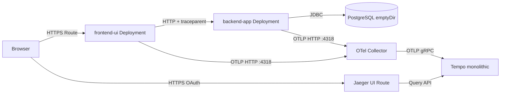

# OpenShift 4.18 Observability Demo — 3-Layer App, Tempo, Collector & Jaeger UI

> **Git branch `auto-instrumentation`:** Same project **`observability-single-span`**. **Red Hat build of OpenTelemetry** [Java auto-instrumentation](https://developers.redhat.com/articles/2026/02/25/how-use-auto-instrumentation-opentelemetry) injects the **Java agent** into **`frontend-ui`** and **`backend-app`** pods; traces export as **`service.name` `order-demo-app`** — see **`docs/auto-instrumentation.md`**. (Manual Micrometer/OTel SDK naming lives on branch **`single-span`**.)

Guide to deploy a **three-layer traceable demo** on **OpenShift Container Platform 4.18**: **frontend UI** (Spring MVC + Thymeleaf), **backend monolith** (Spring Boot + JPA + PostgreSQL), **PostgreSQL** (ephemeral `emptyDir` only), plus **TempoMonolithic**, **Red Hat build of OpenTelemetry Collector**, and **Jaeger UI** (query against Tempo). Application images are built **in-cluster** via **`BuildConfig`** + Git. **No Helm, no Argo CD, no PVCs.**

Manifests live in **`openshift/`** in [github.com/sawoohoorun/ocp-observ-monolithic](https://github.com/sawoohoorun/ocp-observ-monolithic). This document describes **purpose**, **order of apply**, and **commands** — not full YAML dumps.

---

## Architecture Summary



- **Two Deployments** (**`frontend-ui`**, **`backend-app`**) run with **operator-injected Java auto-instrumentation** → OTLP to the same **Collector** → **Tempo** → **Jaeger UI**; both use **`service.name` `order-demo-app`** (from the **`Instrumentation`** CR).
- **PostgreSQL** stores demo rows only; traces are **not** in Postgres.

---

## Upgraded 3-Layer Application Architecture

| Layer | Workload | Responsibility |
|-------|----------|----------------|
| **1 — Frontend UI** | `frontend-ui` | Serves HTML with **Get Order / Check Inventory / Calculate Price** actions. Each action performs a **server-side** `RestClient` call to `backend-app`. The **Java agent** propagates **W3C** context and emits **HTTP server / client** spans so **one trace ID** spans UI + API + DB. |
| **2 — Backend monolith** | `backend-app` | REST `/api/...`; **JPA + JDBC** instrumented by the agent (**DB client** spans follow OpenTelemetry JDBC semantics). |
| **3 — Data** | `postgres` | Single non-HA **Deployment**, **`emptyDir`** data volume, **init SQL** via ConfigMap → `docker-entrypoint-initdb.d`. |

---

## Frontend UI Design

- **Stack:** Spring Boot **3.4**, **Thymeleaf** (server-side rendering — no browser JS tracing required for the demo).
- **Service name (this branch):** **`order-demo-app`** via **`OTEL_SERVICE_NAME`** on the **`Instrumentation`** CR (keeps UI + API under **one** Jaeger service). `spring.application.name` is still **`order-demo-app`** for logging consistency only.
- **Outbound calls:** `RestClient` to `demo.backend-base-url` (overridden in-cluster by **`DEMO_BACKEND_BASE_URL`** → `http://backend-app.observability-single-span.svc.cluster.local:8080`).
- **User actions:** Links such as `/action/order/ORD-001`, `/action/inventory/SKU-100`, `/action/pricing/SKU-100` each trigger one backend round-trip and **one distributed trace** spanning UI + API + DB.

---

## Backend Monolith Design

- **Stack:** Spring Web, Actuator, **Data JPA**, **PostgreSQL** driver. **No in-app OTLP exporter** on this branch — the **injected Java agent** exports traces.
- **Service name (this branch):** **`order-demo-app`** (same resource as UI for Jaeger).
- **APIs:** `GET /api/orders/{id}`, `GET /api/inventory/{sku}`, `GET /api/pricing/{sku}`.
- **Layers:** `ApiController` → `OrderService` / `InventoryService` / `PricingService` → JPA repositories → PostgreSQL.
- **DSN:** `jdbc:postgresql://postgres.observability-single-span.svc.cluster.local:5432/demodb` with password from **`DB_PASSWORD`** (Secret).

---

## PostgreSQL Demo Layer

- **Image:** `docker.io/library/postgres:16-alpine` (if your cluster blocks Docker Hub, mirror or substitute a Red Hat–compatible image and update **`openshift/40-postgres.yaml`**).
- **Storage:** **`emptyDir`** only at `/var/lib/postgresql/data` — data is **lost** when the pod is deleted.
- **Bootstrap:** ConfigMap **`postgres-init`** mounted as **`/docker-entrypoint-initdb.d`**; creates `orders`, `inventory`, `pricing` and seeds **`ORD-001`**, **`SKU-100`**, etc.
- **Credentials:** Secret **`postgres-secret`** (referenced by Deployment and backend).

---

## Cross-Service Trace Propagation

1. **Browser → UI Deployment:** HTTP GET; the **Java agent** creates the **root SERVER** span for the servlet/Spring MVC request (**span names follow agent + stable HTTP semconv**, not custom `app:` / `step:` labels from the **`single-span`** branch).
2. **UI → API:** Agent-instrumented **`RestClient`** (and related HTTP client stack) propagates **`traceparent`**; the API pod’s agent creates **child SERVER** spans for `/api/...`.
3. **Backend → Postgres:** JDBC is instrumented by the agent (**CLIENT**-style DB spans).
4. **Export:** Each pod’s agent sends OTLP **HTTP** to **`http://otel-collector.observability-single-span.svc.cluster.local:4318`** (endpoint configured on the **`Instrumentation`** CR).

**Correlation contract:** One user action MUST yield **one trace ID**. **`OTEL_SERVICE_NAME=order-demo-app`** on the **`Instrumentation`** CR keeps a **single Jaeger service** for both tiers. Details: **`docs/auto-instrumentation.md`**.

---

## Same trace ID and single Jaeger service (`order-demo-app`)

**Tracing:** Pods are annotated for **`instrumentation.opentelemetry.io/inject-java: demo-java`**, referencing **`openshift/12-instrumentation.yaml`**. The **`Instrumentation`** CR sets **`OTEL_SERVICE_NAME`**, **`OTEL_EXPORTER_OTLP_ENDPOINT`**, **`OTEL_SEMCONV_STABILITY_OPT_IN=http`**, **propagators** (**`tracecontext`**, **`baggage`**), and a **sampler** (aligned with [Red Hat’s auto-instrumentation article](https://developers.redhat.com/articles/2026/02/25/how-use-auto-instrumentation-opentelemetry)).

**Application code:** No Micrometer OTLP bridge, no manual OpenTelemetry spans — the demo follows the **zero-code injection** model from the operator.

### Headers: `traceparent`, `tracestate`, and `baggage`

| Mechanism | Role in this demo |
|-----------|-------------------|
| **`traceparent`** (W3C Trace Context) | **Required** on the wire. Injected/extracted by the **Java agent** on outbound **`RestClient`** and inbound servlet traffic. |
| **`tracestate`** | **Optional**; absence alone does not mean broken propagation. |
| **W3C Baggage** | **Not used** in the default configuration. |

### Jaeger

Filter **Service** **`order-demo-app`**; open a trace and confirm **one trace ID** and agent-generated HTTP + JDBC children — **`docs/auto-instrumentation.md`**.

### Troubleshooting split traces

See **Troubleshooting — distributed trace correlation** in the main table: missing **`traceparent`**, async without propagation, wrong client, or sampling.

---

## Database Span Visibility in Jaeger

- **Approach:** **Java agent JDBC** instrumentation (no manual `db:` spans in application code on this branch).
- **Naming:** Span names and attributes follow the **agent** and **stable database semantic conventions** (see agent docs / Jaeger detail view).
- **Missing DB spans:** Confirm the **injected** pod spec includes **`-javaagent:`** and **`OTEL_*`** env from the operator; check **`oc describe pod`** and agent logs if needed.

---

## OCP 4.18 Assumptions

- Connected cluster, **`redhat-operators`**, **OperatorHub** for Path B.
- **`cluster-admin`** for operators and **`observability-single-span`**.
- Build pods: Git + Maven Central; app pods: pull **internal registry** + optional **docker.io** for Postgres.
- **PSA** on `observability-single-span`: **`enforce: baseline`**, **`audit`/`warn: restricted`** (Tekton-friendly); app **`Deployment`s** use restricted-style `securityContext`.

---

## Existing Source Code Assessment

The repository is the application source:

- **`frontend-ui/`** — Thymeleaf UI + `RestClient` to backend.
- **`backend-app/`** — REST API, JPA entities/repositories, traced services.
- **`openshift/`** — All deploy/build/operator operand YAML for this demo.
- **`tekton/`** — OpenShift Pipelines Tasks, `Pipeline`, sample `PipelineRun`, and **`tekton/README.md`** (CI/CD).

The previous single **`spring-monolith`** tree was **removed** in favor of this split.

---

## Repository Structure Summary

```text
├── backend-app/           # Maven, Spring Boot API + JPA
├── frontend-ui/           # Maven, Spring Boot + Thymeleaf
├── openshift/             # Namespaces, operators, Tempo, Collector, Instrumentation, Postgres, builds, Deployments, Routes
├── tekton/                # Tekton pipeline + tasks (optional automation)
├── OCP-4.18-Observability-Demo-Deployment.md
└── README.md              # kept in sync with this guide
```

---

## What Changed in the Application Code

| Area | Change | Why |
|------|--------|-----|
| **Layout** | Replaced single `spring-monolith` with **`frontend-ui/`** + **`backend-app/`** | Separate deployments and routes; unified **`order-demo-app`** via **`Instrumentation`**. |
| **Manifests** | **`openshift/12-instrumentation.yaml`** + numbered `20`–`40` | Operator **`Instrumentation`** CR + injected workloads. |
| **Backend** | JPA + Postgres; traces from **Java agent** only | Matches Red Hat **auto-instrumentation** flow. |
| **Frontend** | Thymeleaf + **`RestClient`** | Agent instruments servlet + HTTP client. |
| **Postgres** | New `40-postgres.yaml` | Ephemeral DB with seed data; **no PVC**. |

---

## File Tree

```text
openshift/
├── 00-namespace.yaml
├── 01-operatorgroup.yaml
├── 02-subscriptions.yaml
├── 10-tempo.yaml
├── 11-otel-collector.yaml
├── 12-instrumentation.yaml     # Instrumentation CR (Java agent → OTLP collector)
├── 20-ui-buildconfig.yaml      # ImageStream + BuildConfig (frontend-ui)
├── 21-ui-deployment.yaml
├── 22-ui-service.yaml
├── 23-ui-route.yaml
├── 30-backend-buildconfig.yaml # ImageStream + BuildConfig (backend-app)
├── 31-backend-deployment.yaml
├── 32-backend-service.yaml
├── 40-postgres.yaml            # Secret, ConfigMap, Service, Deployment
└── 30-smoketest.md
```

---

## File Purpose Summary

| File | Purpose |
|------|---------|
| `00-namespace.yaml` | Operator + `observability-single-span` namespaces. |
| `01-operatorgroup.yaml` | OperatorGroups for Tempo + OpenTelemetry operators. |
| `02-subscriptions.yaml` | `tempo-product`, `opentelemetry-product` subscriptions. |
| `10-tempo.yaml` | `TempoMonolithic` + **Jaeger UI Route** + memory storage. |
| `11-otel-collector.yaml` | `OpenTelemetryCollector` OTLP in → Tempo gRPC out. |
| `12-instrumentation.yaml` | **`Instrumentation`** CR: Java agent, OTLP endpoint, **`OTEL_SERVICE_NAME`**, propagators, sampler. |
| `20-ui-buildconfig.yaml` | Git `ref: auto-instrumentation`, `contextDir: frontend-ui` → **`frontend-ui:1.0.0`**. |
| `21–23` | UI Deployment (**inject-java** annotation + backend URL), Service, **Route**. |
| `30-backend-buildconfig.yaml` | Git `ref: auto-instrumentation`, `contextDir: backend-app` → **`backend-app:1.0.0`**. |
| `31–32` | Backend Deployment (**inject-java** + `DB_PASSWORD`), ClusterIP **Service**. |
| `40-postgres.yaml` | Postgres **emptyDir**, init schema/data, **Secret** password. |

**Edit if needed:** `spec.source.git` in both `BuildConfig`s for forks/branches; Postgres **image** in `40-postgres.yaml` if Docker Hub is blocked.

---

## Prerequisites

- `oc` CLI, cluster-admin (install), pull secrets if using private registries.
- Resource headroom: Tempo + Collector + Postgres + 2 Java pods + build pods.

---

## Deployment Option Matrix

| Step | Path A — CLI | Path B — Console |
|------|--------------|------------------|
| Operators | `oc apply -f openshift/00–02` | OperatorHub → Tempo + OpenTelemetry |
| Operands + apps | `oc apply` + `oc start-build` | Same after CSV **Succeeded** |

---

## Operator Installation Steps

```bash
oc apply -f openshift/00-namespace.yaml
oc apply -f openshift/01-operatorgroup.yaml
oc apply -f openshift/02-subscriptions.yaml
oc get csv -n openshift-tempo-operator
oc get csv -n openshift-opentelemetry-operator
```

Wait for **`Succeeded`**.

---

## Observability Stack Deployment Steps

```bash
oc apply -f openshift/10-tempo.yaml
oc apply -f openshift/11-otel-collector.yaml
oc apply -f openshift/12-instrumentation.yaml
```

Jaeger UI is enabled on **`TempoMonolithic`** (`spec.jaegerui.enabled` + `route.enabled`). List routes: `oc get routes -n observability-single-span`.

---

## Application Build Steps Using OpenShift Build / S2I

**Strategy:** **Docker** `BuildConfig` + Git (multi-stage `Dockerfile` + Maven Wrapper in each app) — same rationale as before: **Java 21**, reproducible builds, no pre-committed `target/`.

1. **PostgreSQL first** (schema before backend):

   ```bash
   oc apply -f openshift/40-postgres.yaml
   oc rollout status deployment/postgres -n observability-single-span --timeout=300s
   ```

2. **Register builds & start** (order flexible; backend is often built first):

   ```bash
   oc apply -f openshift/30-backend-buildconfig.yaml
   oc apply -f openshift/20-ui-buildconfig.yaml
   oc start-build backend-app -n observability-single-span --follow
   oc start-build frontend-ui -n observability-single-span --follow
   ```

3. **Inspect:**

   ```bash
   oc get builds -n observability-single-span
   oc describe is backend-app -n observability-single-span
   oc describe is frontend-ui -n observability-single-span
   ```

---

## Application Deployment Steps

```bash
oc apply -f openshift/32-backend-service.yaml
oc apply -f openshift/31-backend-deployment.yaml
oc rollout status deployment/backend-app -n observability-single-span --timeout=300s

oc apply -f openshift/22-ui-service.yaml
oc apply -f openshift/23-ui-route.yaml
oc apply -f openshift/21-ui-deployment.yaml
oc rollout status deployment/frontend-ui -n observability-single-span --timeout=300s

oc get route frontend-ui -n observability-single-span -o jsonpath='{.spec.host}{"\n"}'
```

Apply **Deployments only after** images exist (or expect short `ImagePullBackOff` until builds finish).

---

## OpenTelemetry in Code (this branch)

**Model:** **No** Micrometer OTLP bridge and **no** hand-written OpenTelemetry spans in the app — tracing is entirely from the **operator-injected Java agent**, as described in [How to use auto-instrumentation with OpenTelemetry](https://developers.redhat.com/articles/2026/02/25/how-use-auto-instrumentation-opentelemetry).

**W3C trace context:** The agent injects and propagates **`traceparent`** on **`RestClient`** outbound calls and servlet inbound handling. Keep using Spring’s **`RestClient`** (`ClientConfig`); avoid raw HTTP clients that bypass the instrumented stack.

### 1. Frontend UI

- **Inbound:** Agent-backed **SERVER** spans for MVC/Tomcat (names follow **stable HTTP** semantics).
- **Outbound:** Agent-backed **CLIENT** spans for the **`RestClient`** call to **`backend-app`**.
- **Browser:** Still a **full-page GET** to **`frontend-ui`** only; the trace **starts** in the UI pod.

### 2. Backend app

- **Inbound:** Agent **SERVER** spans for `/api/...`.
- **Database:** Agent **JDBC** spans under the request (Hibernate/JPA may add nested spans depending on agent version).

### 3. Service naming and export

- **`OTEL_SERVICE_NAME=order-demo-app`** is set on the shared **`Instrumentation`** CR (`openshift/12-instrumentation.yaml`).
- **OTLP HTTP** endpoint for the agent: **`http://otel-collector.observability-single-span.svc.cluster.local:4318`** (same host as the collector **Service**; the agent appends the OTLP path).

**Manual span naming** (`app: get order`, `step: …`, `db: select …`) is implemented on Git branch **`single-span`**, not here.

---

## Jaeger UI Enablement

- Configured on **`TempoMonolithic`** in `openshift/10-tempo.yaml` (`jaegerui.enabled`, `route.enabled`).
- **Jaeger UI does not store traces** here — it **queries Tempo**.
- Access: **Route** in `observability-single-span` (plus OAuth). Fallback: `oc port-forward` to the Jaeger UI / query **Service** if routes are restricted.

---

## Tracing Testing

**Goal:** Prove **one trace ID** for **one** UI action, with **Service** **`order-demo-app`**, using **Java auto-instrumentation** — **`docs/auto-instrumentation.md`**.

**Look for:** Agent-generated **HTTP SERVER** (UI), **HTTP CLIENT** (UI→API), **HTTP SERVER** (API), **JDBC** / DB-related **CLIENT** spans (exact names depend on agent + semconv version).

1. **Trigger exactly one UI action** — e.g. open the **`frontend-ui`** Route and click **Get Order** once.
2. **Open Jaeger UI** (Tempo-backed route in **`observability-single-span`**).
3. **Service** = **`order-demo-app`** → **Find Traces** → open **one** trace.
4. Confirm **one trace ID** for all spans and a sensible parent/child waterfall (**`docs/auto-instrumentation.md`**).
5. Confirm **database-related** child spans exist on the API side (attributes often include **`db.system`** when using stable DB conventions).

**Additional checks:** **`oc get instrumentation,pods -n observability-single-span`**; **`oc describe pod`** on an app pod and confirm **`-javaagent:`** + **`OTEL_*`** env. **Collector:** `oc logs -n observability-single-span -l app.kubernetes.io/name=otel-collector --tail=80`. **If no traces:** verify **`12-instrumentation.yaml`** applied, operator **Succeeded**, injection annotations present, Collector + Tempo **Ready**.

**Jaeger search tip:** With a single **`service.name`**, the service list shows **`order-demo-app`** once; the trace detail still shows the full span tree.

---

## UI Click Trace Testing

1. Browse to **`https://<frontend-ui-route-host>/`**.
2. Click **Get Order** **once** → expect the result page for **`ORD-001`**.
3. In Jaeger, open **one** trace for that moment in time.
4. Verify **Trace ID** is shared: copy the trace id from the UI if available; confirm **all** listed spans use that id (no second trace for the same click).
5. Verify **process** tags show **`order-demo-app`** for all spans and **one trace ID** across UI + API + DB-style children (exact span names come from the **Java agent**).
6. Repeat for **Check Inventory** (`SKU-100`) and **Calculate Price** — each click is a **new** trace; repeat steps 3–5 per action.

---

## Jaeger Waterfall Interpretation

- **Top to bottom:** Time flows downward; **width** ≈ duration.
- **Expected shape (Get Order, auto-instrumentation):**  
  **SERVER** (UI HTTP) → **CLIENT** (outbound to API) → **SERVER** (API HTTP) → **CLIENT** / nested spans (**JDBC** / DB). Names follow the **agent** and **OTEL_SEMCONV_STABILITY_OPT_IN=http** (see **`Instrumentation`** CR).
- **Latency:** Sum of **network + JVM + JDBC + Postgres**; narrow DB spans often mean a fast query.
- **Missing DB span:** Confirm **JDBC** instrumentation is enabled in the agent for your stack; **`oc describe pod`** on **`backend-app`** and operator logs if injection failed.

---

## Verification Steps

| Goal | Command / action |
|------|------------------|
| Operators | `oc get csv -n openshift-tempo-operator` ; `oc get csv -n openshift-opentelemetry-operator` |
| Tempo / Collector | `oc get tempomonolithic,pods,opentelemetrycollector -n observability-single-span` |
| Postgres | `oc get pods -l app.kubernetes.io/name=postgres -n observability-single-span` ; `oc logs deploy/postgres -n observability-single-span --tail=20` |
| Backend | `oc get pods -l app.kubernetes.io/name=backend-app -n observability-single-span` ; `curl -sS http://$(oc get svc backend-app -o jsonpath='{.spec.clusterIP}' -n observability-single-span):8080/api/orders/ORD-001` from a debug pod or port-forward |
| Frontend route | `oc get route frontend-ui -n observability-single-span` |
| UI smoke | Browser: click all three actions |
| Jaeger | **Tracing Testing** + **UI Click Trace Testing** |
| Jaeger service | Filter **`order-demo-app`** |

---

## Expected Trace Flow

**One user click (e.g. Get Order)** — **one trace ID** end to end:

1. **SERVER** — inbound HTTP to **`frontend-ui`** (agent).  
2. **CLIENT** — **`RestClient`** call to **`backend-app`** (agent).  
3. **SERVER** — inbound **`/api/orders/...`** on **`backend-app`** (agent).  
4. **CLIENT** / DB — JDBC query to Postgres (agent).  

All spans use **`service.name` `order-demo-app`** in Jaeger. See **`docs/auto-instrumentation.md`**.

---

## Troubleshooting

| Issue | Notes |
|-------|--------|
| Tempo apply **warnings** (multitenancy / `extraConfig`) | See earlier doc revision / Red Hat guidance; lab uses single-tenant **TempoMonolithic** + Jaeger OAuth on the UI Route. |
| Postgres **ReplicaFailure** / SCC (`fsGroup` not allowed) | Do **not** set a fixed **`fsGroup`** outside the namespace range (e.g. `70` is rejected by **restricted-v2**). The manifest omits **`fsGroup`** so the platform assigns a valid group for **`emptyDir`**. |
| Postgres **CrashLoop** on restricted SCC | Try adjusting **image** or **securityContext** per cluster policy; ensure **`emptyDir`** and `PGDATA` subpath as in `40-postgres.yaml`. |
| **ImagePullBackOff** for `postgres:16-alpine` | Use an internal mirror or Red Hat image; update `40-postgres.yaml`. |
| Backend **unready** | Postgres not ready, wrong password, or DB not initialized — check `oc logs deploy/backend-app`. |
| **No DB spans** | Confirm **Java agent** injected on **`backend-app`**; JDBC instrumentation active; check Jaeger for collapsed child spans. |
| **No `-javaagent:` / no `OTEL_*` on app pods** | Apply **`openshift/12-instrumentation.yaml`**; **`oc get instrumentation -n observability-single-span`**; ensure OpenTelemetry operator CSV **Succeeded** and **cert-manager** is healthy for webhooks. |
| **`debug` exporter** errors on Collector | Switch **`debug`** → **`logging`** in `11-otel-collector.yaml` pipeline. |

### Troubleshooting — distributed trace correlation

| Issue | Notes |
|-------|--------|
| **Two traces** for one UI click (frontend one id, backend another) | **`traceparent`** not propagated on the UI→API hop: confirm **Java agent** is injected on **both** tiers and **`RestClient`** is used (agent-instrumented stack). Confirm no raw HTTP client bypassing instrumentation. |
| **Headers not forwarded** | **Edge reverse proxy** / **API gateway** in front of UI or API must **forward** `traceparent` (and `tracestate` if used). OpenShift **Route** to the UI usually does not strip them; custom **Ingress** annotations or **corporate proxies** might. |
| **`@Async` / reactive** breaks propagation | Context is **thread-local** / **Reactor**-scoped; async work must use **supported** context propagation (e.g. **`@Observed`**, **`ContextSnapshot`**, Reactor operators). This demo uses **sync** `RestClient` only. |
| **Manual HTTP client** ignores propagation | Raw **`HttpURLConnection`** or non-instrumented clients may **omit** headers. Prefer Spring **`RestClient`** with the **Java agent** present. |
| **Service names correct but traces split** | Not a naming issue — **exporter** or **sampling** edge cases (rare with probability `1.0`), or **two different requests** (double fetch, prefetch). Use **one** deliberate click and match **timestamps**. |
| **Jaeger search** | Use service **`order-demo-app`**; opening a trace shows **all** spans for that trace id. |
| **Spans exist but DB span in “another” trace** | Usually **two separate HTTP requests** or failed context propagation into JDBC (rare with agent on sync request path). |

---

## Cleanup

```bash
oc delete -f openshift/23-ui-route.yaml --ignore-not-found
oc delete -f openshift/22-ui-service.yaml --ignore-not-found
oc delete -f openshift/21-ui-deployment.yaml --ignore-not-found
oc delete -f openshift/32-backend-service.yaml --ignore-not-found
oc delete -f openshift/31-backend-deployment.yaml --ignore-not-found
oc delete -f openshift/30-backend-buildconfig.yaml --ignore-not-found
oc delete -f openshift/20-ui-buildconfig.yaml --ignore-not-found
oc delete -f openshift/40-postgres.yaml --ignore-not-found
oc delete -f openshift/12-instrumentation.yaml --ignore-not-found
oc delete -f openshift/11-otel-collector.yaml --ignore-not-found
oc delete -f openshift/10-tempo.yaml --ignore-not-found
oc delete project observability-single-span
```

---

## Apply All

```bash
oc apply -f openshift/00-namespace.yaml
oc apply -f openshift/01-operatorgroup.yaml
oc apply -f openshift/02-subscriptions.yaml
# wait for CSVs Succeeded
oc apply -f openshift/10-tempo.yaml
oc apply -f openshift/11-otel-collector.yaml
oc apply -f openshift/12-instrumentation.yaml
oc apply -f openshift/40-postgres.yaml
oc rollout status deployment/postgres -n observability-single-span --timeout=300s
oc apply -f openshift/30-backend-buildconfig.yaml
oc apply -f openshift/20-ui-buildconfig.yaml
```

Then **build images** (see below), then:

```bash
oc apply -f openshift/32-backend-service.yaml
oc apply -f openshift/31-backend-deployment.yaml
oc apply -f openshift/22-ui-service.yaml
oc apply -f openshift/23-ui-route.yaml
oc apply -f openshift/21-ui-deployment.yaml
```

---

## Build and Deploy App

```bash
oc start-build backend-app -n observability-single-span --follow
oc start-build frontend-ui -n observability-single-span --follow
oc rollout status deployment/backend-app -n observability-single-span --timeout=300s
oc rollout status deployment/frontend-ui -n observability-single-span --timeout=300s
```

---

## Tekton CI/CD (optional)

Install **OpenShift Pipelines**, then apply **`tekton/`** and follow **`tekton/README.md`**. Full architecture, parameters, validation, and troubleshooting are in **`OCP-4.18-Observability-Demo-Deployment.md`** under **Tekton CI/CD (OpenShift Pipelines)**.

---

## Web Console Install Path

**Tempo Operator:** **Administrator** → **Operators** → **OperatorHub** → search **Tempo** → **Install** → **`openshift-tempo-operator`**, **stable**, **Automatic**.

**Red Hat build of OpenTelemetry:** **OperatorHub** → **Red Hat build of OpenTelemetry** → **`openshift-opentelemetry-operator`**, **stable**, **Automatic**.

Then apply **`openshift/10-tempo.yaml`**, **`11-otel-collector.yaml`**, **`12-instrumentation.yaml`**, and the rest via CLI as above.

---

## Tracing Test Quickstart

```bash
HOST=$(oc get route frontend-ui -n observability-single-span -o jsonpath='{.spec.host}')
open "https://${HOST}/"
# Click "Get Order", then open Jaeger UI route → service order-demo-app → Find Traces
```

---

## OpenTelemetry in Code (recap)

- **frontend-ui** + **backend-app**: **Java auto-instrumentation** (operator) → OTLP **HTTP** **`otel-collector.observability-single-span.svc.cluster.local:4318`**.  
- **Propagation:** **W3C** **`tracecontext`** (+ **`baggage`** on the **`Instrumentation`** CR) on **RestClient** and servlets.  
- **DB:** **Agent JDBC** spans on **`backend-app`**.  
- **Jaeger:** Queries **Tempo**; filter **`order-demo-app`**.
